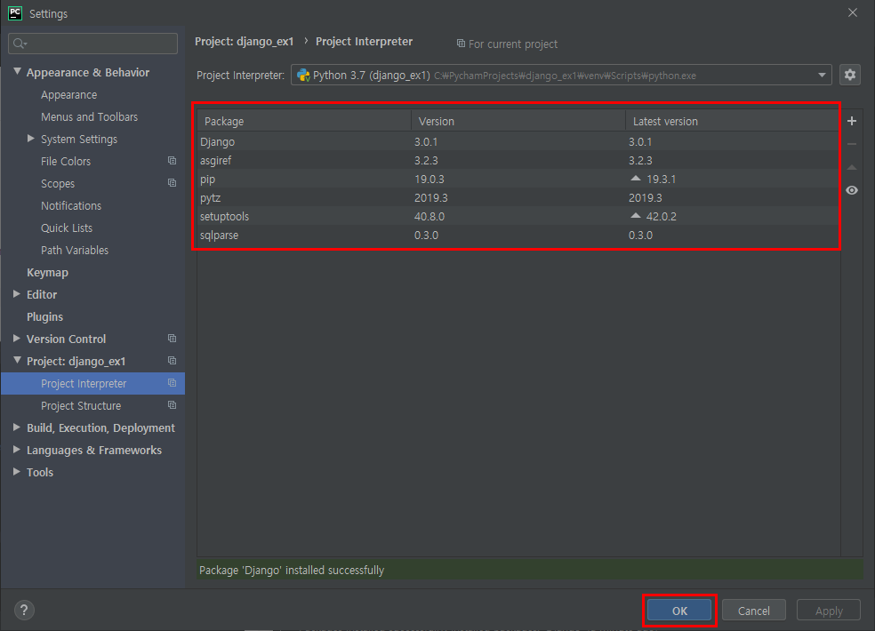

### 2019-12-19

# PycharmProject

## Pycharm

- 파이썬 통합개발환경(IDE)
- Community 버전으로 설치

[https://www.jetbrains.com/ko-kr/pycharm/](https://www.jetbrains.com/ko-kr/pycharm/)

## Django 프로젝트 생성

##### 1. 작업 디렉토리 생성 및 가상환경 구성

- Django 프로젝트와 관련 파일을 담을 작업 디렉토리 생성한다.
- Pycharm 첫 화면의 Create New Project 클릭


- 원하는 프로젝트 폴더 이름으로 변경, 위치 변경 가능

파이참프로젝트 django_ex1 파일을 하나 만들어준다.


Project Interpreter: New Virtualenv environment를 클릭하여 가상환경까지 함께 구성


- 가상환경 : 자신이 원하는 환경을 구축하기 위해 필요한 모듈만 모아둔 독립된 공간

  ▶ 다양한 라이브러리들 간의 충돌을 방지하기 위해 사용

- Location에 원하는 위치에 원하는 이름으로 가상환경 구성

- Base interpreter에서 가장 최신 버전의 파이썬을 지정 후 Create 버튼을 클릭

##### 2. Django 패키지 설치

- 왼쪽 상단의 File - Settings - Project: 프로젝트 명 - Project Interpreter 순으로 클릭


- 아래 그림과 같은 창이 뜨면 먼저 Project Interpreter가 처음에 생성한 가상환경인지 확인


- 창 오른쪽의 + 버튼 클릭

- 'Django'를 검색한 후, 하단의 Install Package를 눌러 Django 설치


- 설치가되면 아래와 같이 성공적으로 설치되었다고 뜬다.


- 창을 닫게 되면 아래의 그림처럼 설치된 패키지들의 리스트를 볼 수 있게된다.



##### 3.  **Django 프로젝트 생성**

- 프로젝트 : 개발 대상이 되는 전체 프로그램
- 하단의 Terminal 탭 클릭


- 아래 명령어를 입력하면 최상위 디렉토리 아래로 Django 프로젝트가 생성된 것을 볼 수 있다.

```bash
django-admin startproject {project_name} .
# 반드시 {project_name} 뒤에 스페이스 한번 누르고 . 입력한다.
django-admin startproject first_prj .
```


- 아래 명령어로도 Django 프로젝트를 생성할 수 있다.

  프로젝트 파일들을 모으는 또 하나의 상위 디렉토리가 만들어지기 때문에 아래의 명령어를 사용해서 최상위 디렉토리와 Django 프로젝트를 분리시킨다.

```bash
django-admin startproject {project_name}
# {project_name}에 내가 만들 프로젝프의 이름을 지정하면된다.
django-admin startproject mybookmark
```


##### 4. **프로젝트 이름 변경 및 위치 이동**

- 현재 내가 어느 위치에 있는지 Terminal 탭에서 확인
- Django 프로젝트를 변경하고 싶은 위치까지 `cd ..` 명령으로 상위 디렉토리로 이동


- 아래 명령어를 입력하면 아래 그림과 같이 Django 프로젝트가 이동한 것을 볼 수 있다.

```bash
move django_project_location {new_name}

move C:\PychamProjects\django_ex1 move_mybokmark
```


- File - Open 을 클릭해 방금 옮긴 Django 프로젝트 열기


##### 5. settings.py 설정


- 먼저 TEMPLATES의 DIRS 부분을 아래와 같이 변경

```python
'DIRS': [os.path.join(BASE_DIR, 'templates')]
```


- 나머지 부분도 다음과 같이 변경

기존


- STATIC~ : 프로젝트의 정적 파일과 관련된 사항을 지정
- MEDIA~ : 미디어 관련 사항을 지정, 파일 업로드 기능을 개발할 때 필요

변경 후


##### 6. **Django 기본 테이블 생성**

- Django는 모든 웹 프로젝트 개발 시 사용자와 사용자의 권한 그룹 테이블이 반드시 필요하다는 가정 하에 설계되었기 때문에 우리가 테이블을 만들지 않았더라도 위의 테이블들을 만들어주기 위해 개발 시작 시점에 `python manage.py migrate` 이 명령을 실행
- 먼저 Terminal 탭을 클릭하여 이전에 생성한 가상환경이 활성화가 되어있는지 확인
- 비활성화 되어있다면 File - Settings - Project - Project Interpreter로 들어가 가상환경 적용
- 아래 명령어를 입력하면 Django의 기본 DB 파일, sqlite3 DB 파일이 생성된다.

```bash
python manage.py migrate
```


##### 7. 

##### 8.


가상환경설정 잘못해서 다시 해야된다아아ㅏㅏ