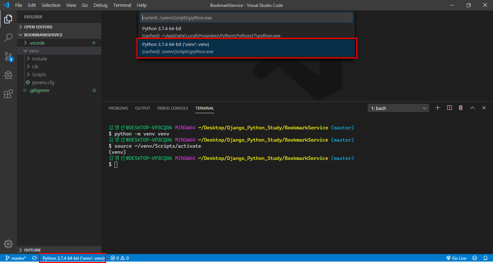
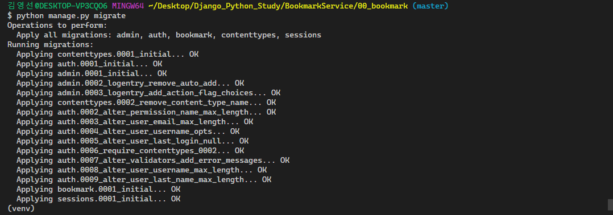
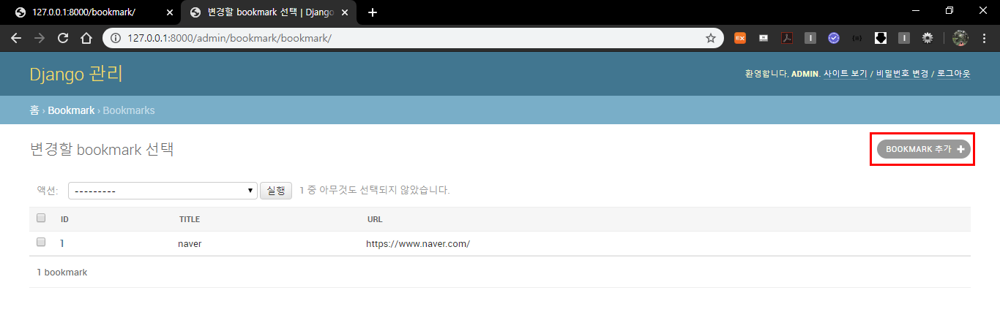
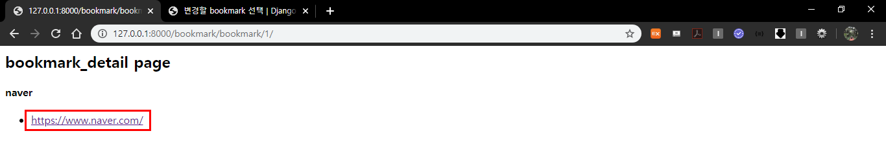

#### 2019-12-28

# Bookmark _숙제

## 1. 북마크 서비스 흐름을 파악한다.(그림으로든 글로든 각자 자신만의 방식으로 정리해오기)

## 2. 각 페이지에 어떤 데이터가 들어가야 할지 생각해보고 해당 데이터에 맞는 ERD와 테이블 구조 그려오기

## 3. 1번과 2번을 바탕으로 북마크 서비스 구현해보기

**나는 우선 vscode로 만들고 pycharm으로도 해보기!**

### - VSCode

#### 3.1 기본설정

##### 3.1.1 `Django_Python_Study`폴더 안에 `BookmarkService`폴더를 생성해준다.


##### 3.1.2 `BookmarkService`폴더 안에서 마우스 우클릭을 해서 `Git Bash Here`을 클릭한다.


##### 3.1.3 git bash 창이 뜨면 `code .`를 입력해 VSCode를 실행시켜준다.


그러면 아래와 같은 창이 뜰것이다.


프로젝트를 생성하기 전에 우선 **가상환경 설정**부터 해주자!

##### 3.1.4 venv 가상환경 설정하기

```bash
# 가상환경을 설치할 폴더에서 실행
$ python -m venv venv

# 가상환경 진입(실행)
$ source venv/Scripts/activate    # venv가 있는 폴더로 들어왔을 때
$ source ~/venv/Scripts/activate  # venv가 위치하고 있는 상세경로로 진입 가능

# 가상환경 나오기
$ deactivate      # 어느 경로에서나 상관없음
```


가상환경을 생성되고 가상환경에 진입한것을 확인할 수 있다.


- **Visual Studio Code에서 기본 가상환경 설정하기**
  
  - `Shift + Ctrl + P` 혹은 `좌측 하단의 파이썬 버전 클릭`해서 우리가 생성한 venv를 기본값으로 선택해준다. (interpreter)
  
  
  
    - 그 다음 VSCode 내장 터미널을 새로 실행하면, 자동으로 `source ~activate`까지의 명령어가 실행되면서 가상환경으로 진입한다.
  
  

##### 3.1.5 `.gitignore`파일 생성하기

[gitignore.io](https://www.gitignore.io/)에서 venv , Django , VisualStudioCode 출력된 결과값 입력


##### + django 기본설정

- .vscode > settings.json에 내용추가

```json
"files.associations": {
        "**/*.html": "html",
        "**/templates/**/*.html": "django-html",
        "**/templates/**/*": "django-txt",
        "**/requirements{/**,*}.{txt,in}": "pip-requirements"
    },
    
    "emmet.includeLanguages": {
        "django-html": "html"
    },
    
    "[django-html]": {
        "editor.tabSize": 2
    }
```


##### 3.1.6 Django 설치

```bash
(venv)
$ pip install django         # 최신버전 설치
$ pip install django==2.1.8  # 원하는 버전 설치
```

**\+** Django **버전**을 최신버전(3.0.1)으로 설치하게 되면 settings.py에서 `LANGUAGE_CODE = 'ko-kr'` 지원을 안해준다!!! 버전을 2.X 대로 낮춰서 설치하쟈!!! 


```bash
# 장고 버전 및 리스트 간단하게 확인
$ pip list
# pip install upgrade
$ python -m pip install --upgrade pip
```

django를 설치하고 확인한 list


#### 3.2 장고프로젝트 시작 및 개발서버 실행

##### 3.2.1 프로젝트 생성 및 폴더이동

```bash
# 장고 프로젝트를 담을 폴더 생성
$ mkdir 00_bookmark
# 폴더로 이동
$ cd 00_bookmark
```


##### 3.2.2 프로젝트 시작위치 설정 : config

```bash
# 프로젝트 시작위치 설정
# Django_Python_Study\BookmarkService\00_bookmark
$ django-admin startproject config .
```


##### 3.2.3 개발서버 실행

```bash
# 반드시 manage.py가 있는 경로에서 명령어 실행
# manage.py : 장고 프로젝트와 의사소통하는 상호작용 커맨드라인 유틸리티
# 서버실행
$ python manage.py runserver
```


서버를 실행해서 아래의 그림과 같이 로켓이 보이면 성공!


#### 3.3 Application 생성 및 등록

##### 3.3.1 bookmark 앱 생성

```bash
# bookmark application 생성
$ python manage.py startapp bookmark
```


bookmark 앱이 생성되었다.


##### 3.3.2 bookmark 앱 등록

settings.py 에서 앱 bookmark를 등록시켜준다.


```python
# 언어, 시간 부분도 수정해주기
LANGUAGE_CODE = 'ko-kr'

TIME_ZONE = 'Asia/Seoul'
```

#### 3.4 Model 설계, admin 설계

models.py 설계

```python
from django.db import models

# Create your models here.
class Bookmark(models.Model):
    title = models.CharField(max_length=100, blank=True)
    url = models.URLField(unique=True)

    def __str__(self):
        return f'[{self.pk}번]:{self.title}'
```

admin.py 설계

```python
from django.contrib import admin
from .models import Bookmark

# Register your models here.
class BookmarkAdmin(admin.ModelAdmin):
    list_display = ('id', 'title', 'url')

admin.site.register(Bookmark, BookmarkAdmin)
```

##### 3.4.1 makemigrations

```bash
$ python manage.py makemigrations
```


##### 4.3.2 sqlmigrate

데이터베이스에 실제로 반영하기 전에 SQL문으로 바뀐 모습을 확인

```bash
$ python manage.py sqlmigrate bookmark 0001
BEGIN;
--
-- Create model Bookmark
--
CREATE TABLE "bookmark_bookmark" ("id" integer NOT NULL PRIMARY KEY AUTOINCREMENT, "title" varchar(100) NOT NULL, "url" varchar(200) NOT NULL UNIQUE);
COMMIT;
(venv) 
```


##### 4.3.3 showmigrations

```bash
$ python manage.py showmigrations
```


##### 3.4.4 migrate

```bash
$ python manage.py migrate
```



migrate를 하고 vscode에 있는 SQLITE EXPLORER를 이용하여 테이블이 만들어진 것을 확인 할 수 있다.


지금은 비어있는 테이블이다.


##### 3.4.5 database 데이터 입력 -  admin 페이지 이용 또는 CRUD 이용 

###### 3.4.5.1 admin 페이지 이용해서 등록

우선 createsuperuser 를 이용하여 관리자를 생성한다.

```bash
$ python manage.py createsuperuser
```


[http://127.0.0.1:8000/admin/](http://127.0.0.1:8000/admin/login/?next=/admin/)페이지로 들어가서 로그인한다.


Bookmarks 를 클릭한다.


BOOKMARK 추가를 클릭한다.



Title 과 Url 에 내용을 입력하고 저장버튼을 누른다.


입력한 내용이 저장되는 것을 확인할 수 있다.


테이블에서도 내용이 저장된 것을 확인할 수 있다.


###### 3.4.5.2  나머지 하나는 CRUD 이용해서 등록

django-extensions 설치 => shell_plus 이용하기 위해

```bash
$ pip install django-extensions
```

shell_plus 실행

```bash
$ python manage.py shell_plus
```


일단, bookmark 모델을 import해준다.

```powershell
In [1]: from bookmark.models import Bookmark
```

저장된 객체 확인하기

```powershell
In [2]: Bookmark.objects.all()
Out[2]: <QuerySet [<Bookmark: [1번]:naver>, <Bookmark: [2번]:daum>]>
```

객체 저장하기

```powershell
# 여러 방법이 있지만 쿼리셋 객체로 저장하는 방법을 써볼꺼다.
In [3]: Bookmark.objects.create(title='google',url='https://www.google.co.kr/')
Out[3]: <Bookmark: [3번]:google>
```

저장된 객체 확인하기

```powershell
In [4]: Bookmark.objects.all()
Out[4]: <QuerySet [<Bookmark: [1번]:naver>, <Bookmark: [2번]:daum>, <Bookmark: [3번]:google>]>
```

테이블에서도 내용이 저장된 것을 확인할 수 있다.


shell 종료

```powershell
In [5]: exit()
```


#### 3.5 URLconf 및 VIEW 설계 

##### 3.5.1 bookmark 앱 안에 urls.py 를 만들어준다.


##### 3.5.2  config/urls.py 를 수정해준다. bookmark/urls.py로 연결해주기

우선 `include`를 import 해준다.

`'bookmark/'`를 입력했을 때 페이지가 뜨게 만들꺼다.

`path()`를 이용해 `bookmark/urls.py`를 연결시켜준다.

```python
from django.contrib import admin
from django.urls import path, include

urlpatterns = [
    path('bookmark/', include('bookmark.urls')),
    path('admin/', admin.site.urls),
]
```

##### 3.5.3 bookmark/urls.py 수정 - app_name 지정, view연결

```python
from django.urls import path
from . import views

app_name = 'bookmark'

urlpatterns = [
    path('', views.index, name='index'),
    path('bookmark/<int:bookmark_pk>/', views.detail, name='detail'),
]
```

##### 3.5.4 views.py 코드 추가 - index 함수 추가

```python
from django.shortcuts import render, get_object_or_404
from .models import Bookmark

# Create your views here.

def index(request):
    context = {
        'bookmark_list' : Bookmark.objects.all(),
    }
    return render(request,'bookmark/index.html', context)
```

##### 3.5.5 views.py 코드 추가 - detail 함수 추가

```python
from django.shortcuts import render, get_object_or_404
from .models import Bookmark

def detail(request, bookmark_pk):
    bookmark = get_object_or_404(Bookmark, pk=bookmark_pk)
    context = {
        'bookmark' : bookmark,
    }
    return render(request,'bookmark/detail.html', context)
```


#### 3.6 Templates

settings.py 에서 `'DIRS'` 경로 설정해주기 - config/templates 폴더를 생성해준다.

```python
TEMPLATES = [
    {
        ...
        # templates 경로 설정
        'DIRS': [os.path.join(BASE_DIR, 'config', 'templates')],
        ...
    },
]
```

templates 폴더안에 앱이름과 같은 bookmark 폴더를 만들어준다. 그리고 bookmark폴더안에 index.html,detail.html 파일을 만들어준다.

 

##### 3.6.1 index.html 코드 수정

```django
<h2>bookmark_index page</h2>

<h4>Bookmark_List</h4>
<ul>
  
    <li><a href="">{{ bookmark.title }}</a></li>
  
    <li>등록된 북마크가 없습니다.</li>
  
</ul>
```


##### 3.6.2 detail.html 코드 수정

```django
<h2>bookmark_detail page</h2>

<h4>{{ bookmark.title }}</h4>
<ul>
  <li><a href='{{ bookmark.url }}'>{{ bookmark.url }}</a></li>
</ul>
```




url을 클릭하게 되면 해당 웹페이지로 이동한다.


### - Pycharm

