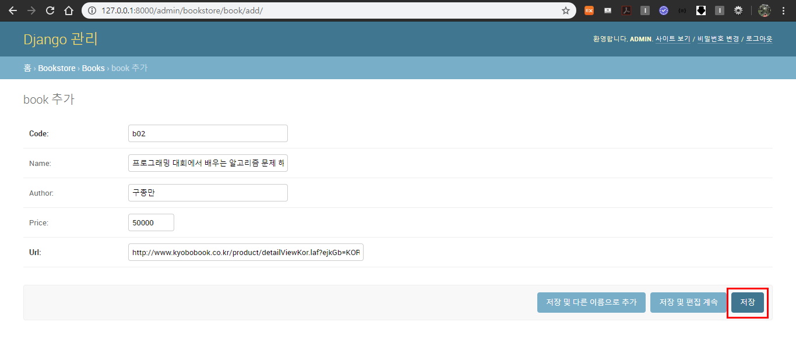

#### 2020-01-04

# Bookstore _숙제

# 설계(구성)하기

#### 1. UI 설계

아래의 그림과 같이 페이지를 개발할 것이다. (예시)

책 제목을 클릭하게 되면 detail 페이지로 넘어가면서 해당 책의 가격과 구매링크가 뜨게 할 것이다.


#### 2. Model 설계 - DB 테이블 

아래의 표와같이 모델을 설계할 것이다.


#### 3. URL 설계


# 개발하기

# VSCode

## 1. 프로젝트 생성 및 기본설정

### 1.1 프로젝트 생성

```bash
# BookmarkService/
# 01_bookstore 폴더 생성하기
$ mkdir 01_bookstore
```

```bash
# BookmarkService/01_bookstore
# 01_bookstore 폴더로 이동하기
$ cd 01_bookstore/
```

```bash
# BookmarkService/01_bookstore
# django 프로젝트 만들기
$ django-admin startproject config .
```


### 1.2 애플리케이션 생성

```bash
# BookmarkService/01_bookstore
# bookstore 애플리케이션 만들기
$ python manage.py startapp bookstore
```


### 1.3 기본설정 - settings.py

#### 1.3.1 templates 경로 설정해주기

기본으로 프로젝트를 생성하게 되면 `templates` 경로는 처음에 반드시 커스터마이징해서 지정해주자!! 

```python
# templates 경로 설정, 나의 경우에는 config 폴더안에 templates 폴더를 생성하고 경로를 설정할 것이다.
'DIRS': [os.path.join(BASE_DIR, 'config', 'templates')],
```

#### 1.3.2 애플리케이션 등록

위에서 만든 `bookstore` 애플리케이션을 등록해주자.

등록하는 방법에는 두가지 방법이 있다.

첫번째 방법은, apps.py에서 자동으로 생성된 class 함수명 `BookstoreConfig`을 아래의 코드로 등록해주는 방법이다.

``` python
INSTALLED_APPS = [
    ...
    'bookstore.apps.BookstoreConfig'
]
```

두번째 방법은, 아래의 코드처럼 내가 생성한 애플리케이션의 이름을 명시해 주는것이다.

```python
INSTALLED_APPS = [
    ...
    'bookstore',
]
```

#### 1.3.3  LANGUAGE_CODE, TIME_ZONE 변경해주기

```python
LANGUAGE_CODE = 'en-us'

TIME_ZONE = 'UTC'
```

위의 코드를 아래의 코드로 변경해주기

```python
LANGUAGE_CODE = 'ko-kr'

TIME_ZONE = 'Asia/Seoul'
```

## 2.  Model 만들기 - models.py

Book 모델을 만들어 보자.


#### 2.1 Bookstore 모델 설계하기

```python
from django.db import models

# Create your models here.
class Book(models.Model):
    code = models.CharField(max_length=100, primary_key=True)
    name = models.CharField(max_length=100, blank=True, null=True)
    author = models.CharField(max_length=100, blank=True, null=True)
    price = models.IntegerField(null=True, blank=True)
    url = models.URLField(unique=True)

    def __str__(self):
        return f'[{self.code}번] : [책이름 : {self.name}]'
```

#### 2.2 show,makemigrations

```bash
$ python manage.py showmigrations
```


```bash
$ python manage.py makemigrations
```


#### 2.3 migrate

```bash
$ python manage.py migrate
```


DB에 반영되어 X표시가 된것을 볼 수 있다.


아직은 데이터 입력을 하지 않았기때문에 테이블이 비어있다.


#### 2.4 admin 등록 - admin.py

BookstoreAdmin을 만들기 전에 모델 Bookstore을 import 해준다.

```python
from django.contrib import admin
from .models import Book

# Register your models here.
class BookAdmin(admin.ModelAdmin):
    list_display = ('code', 'name', 'author', 'price', 'url')

admin.site.register(Book, BookAdmin)
```

#### 2.5 장고 웹사이트 서버켜서 확인하기

```bash
$ python manage.py runserver
```

[http://127.0.0.1:8000/admin](http://127.0.0.1:8000/admin)에 로그인해서 확인!

계정이없다면 아래의 코드를 입력해 계정을 생성한다.

```bash
$ python manage.py createsuperuser
```


#### 2.6 admin 페이지에서 데이터 입력하기

위의 이미지에서 Books을 클릭하면 아래의 화면이 뜨게되는데 


Book추가를 클릭해서 데이터들을 저장해준다. code는 b01,b02..이런식으로 지정해준다.

아래의 그림처럼 입력하고 저장버튼을 누른다.



아래의 그림처럼 저장된 데이터들이 리스트 형식으로 보이게 된다.


vscode에서 확인한 데이터가 입력된 테이블이다.


## 3. URL - urls.py

#### 3.1 bookstore 애플리케이션 안에 urls.py 만들기


#### 3.2 config/urls.py 에서 bookstore/urls.py 연결해주기

```python
# config/urls.py
from django.contrib import admin
from django.urls import path, include

urlpatterns = [
    path('admin/', admin.site.urls),
    path('bookstore/', include('bookstore.urls')),
    # re_path(r^'bookstore/', include('bookstore.urls')),
]
```

#### 3.3 bookstore/urls.py 코드 수정하기

```python
# bookstore/urls.py
from django.urls import path,re_path
from . import views

app_name = 'bookstore'

urlpatterns = [
    # path('', views.Bookstore_index, name='index'),
    re_path(r'^$', views.Bookstore_index, name='index'),
    path('<str:bookstore_code>/', views.Bookstore_detail, name='detail'),
    # re_path(r'^', views.Bookstore_detail, name='detail'),
]
```

## 4. View - views.py

```python
from django.shortcuts import render, get_object_or_404
from .models import Book

# Create your views here.
def Bookstore_index(request):
    context = {
        'book_list' : Book.objects.all(),
    }
    return render(request, 'bookstore/bookstore_index.html', context)

def Bookstore_detail(request, bookstore_code):
    book = get_object_or_404(Book, code=bookstore_code)
    context = {
        'book' : book,
    }
    return render(request, 'bookstore/bookstore_detail.html', context)
```

## 5. Templates 

위에서 `settings.py` 수정을 할때 templates의 경로를 `config/templates` 로 지정하였다.

config 폴더안에 templates 폴더를 만들고 그안에 애플리케이션과 같은 이름의 폴더 bookstore를 만들어준다.


#### 5.1 bookstore_index.html

```django
<h2>Bookstore_index_page</h2>

<h4>Book_List</h4>
<ul>
  
    <li><a href="">{{ book.name }}</a></li>
    <p>저자 : {{ book.author }}</p>
  
    <li>등록된 북마크가 없습니다.</li>
  
</ul>
```

#### 5.2 bookstore_detail.html

```django
<h2>Bookstore_detail_page</h2>

<h1>{{ book.name }}</h1>
<h3>저자 : {{ book.author }}</h3>
<ul>
    <li>가격 : {{ book.price }}</li>
    <li>구매링크 : <a href="{{ book.url }}">{{ book.url }}</a></li>
</ul>
```

## 6.  결과 화면

책 제목을 클릭하면


해당 책제목의 상세 페이지로 이동되며 가격과 구매링크가 뜨게 된다.


구매 링크를 클릭하게 되면 구매링크 페이지로 이동한다.


# Pycharm

