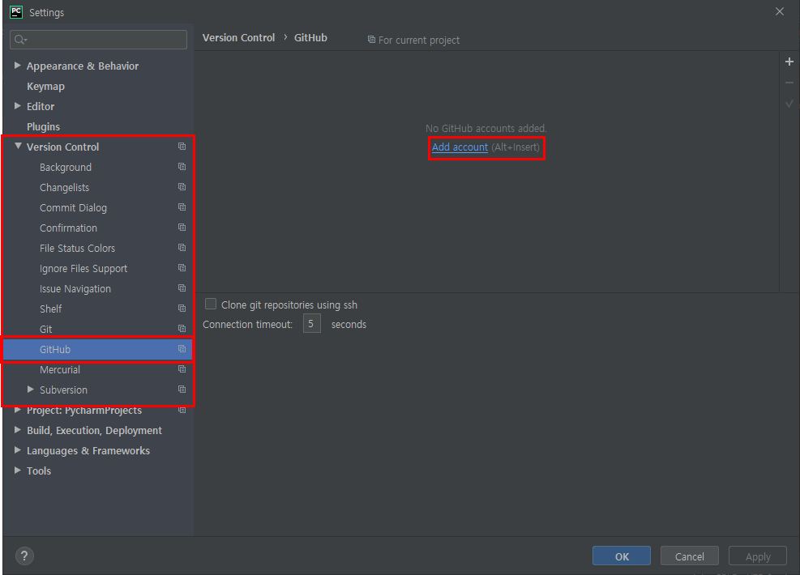
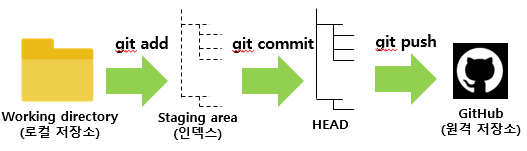
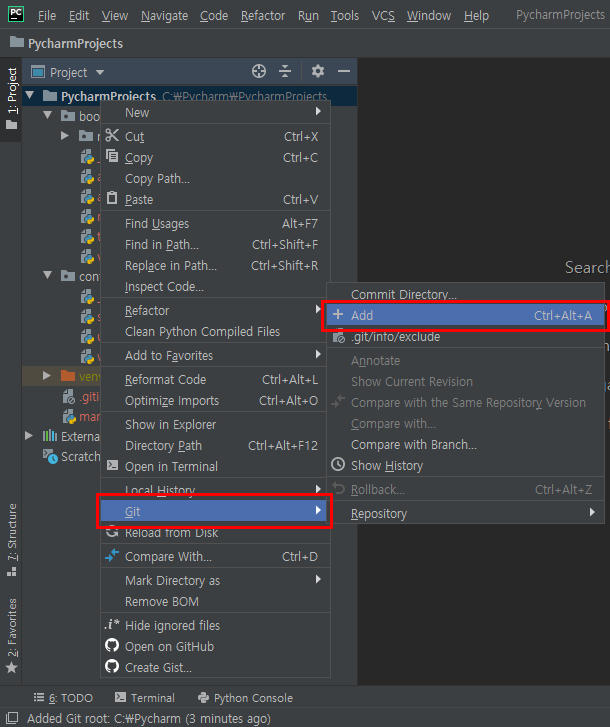

#### 2020-01-05

# Pycharm 프로젝트 Github에 올리는 방법

Pycharm 프로젝트를 GitHub에 올리는 방법을 정리해보도록 할것이다. 

자세한 명령어들은 `Git 사용하기.md`에 우선 많이쓰이는 순으로 정리해 두었고 지금은  기본적으로 프로젝트와 깃의 연결,업로드 등을 위한 기본 명령어들만 사용하는 것을 보여줄 것이다.

우선, 기존에 스터디를 통해서 Pycharm 프로젝트를 생성했을 것이다. GitHub에 프로젝트를 올리기 전에 프로젝트 내부에  `.gitignore` 파일을 만들어보도록하자.

## 1. Pycharm 프로젝트에서 `.gitignore` 파일 생성하기

` .gitignore`는 파일 이름이다. 이 파일은 Git 커밋 예외를 지정하기 위해 사용된다. 특정 파일 및 디렉토리들을 이 파일에 기록하므로써 Git은 해당 파일 및 디렉토리들을 추적하지 않는다. 프로젝트 루트 폴더에 `.gitignore` 파일을 생성한다.

### 1.1 Plugins - .ignore 설치하기

`File - Settings(ctrl + alt +s) - Plugins` 로 들어간다.

`.ignore`을 검색해서 설치를 눌러준다.


설치가 완료되면 프로그램을 다시 실행시키는 `Restart IDE`버튼을 누른다.


누르면 아래의 `Restart` 버튼을 눌러준다.


그러면 프로그램이 꺼졌다가 다시 실행될 것이다.

### 1.2 `.gitignore` 파일 생성하기

해당 프로젝트의 최상의 폴더(Pycharm 폴더) 마우스 우클릭을 해준다.  그 다음 아래의 사진과 같이 `New - .ignore file - .gitignore file (Git)`순으로 클릭해준다. **(파일의 위치는 `README.md `파일과 동일한 폴더에 생성하면된다!!)** 


차례대로 클릭하게 되면 아래의 그림과 같은 창이 뜨게 된다.


여기서 선택해줘야 할 것들은 `Example user template`, `Python`, `JetBrain`, `VirtualEnv` 이다.


모든 선택을 했으면 `Generate` 버튼을 눌러 `.gitignore`파일을 생성한다.

그러면, 프로젝트 안에 `.gitignore` 파일이 아래와 그림과 같이 생성되었다. 


Pycharm에서 Git에 연결할 수 있는 방법은 몇가지가 있다. 일단, 나는 git bash를 활용할 것이고 뒷부분에서는 Pycharm에서 바로 GitHub에 업로드 할 수 있는 방법을 알려줄 것이다. (써본 결과 Pycharm이 생긴건 안드로이드스튜디오랑 비슷한거같다..!)

### 1.3 [추가] settings - Version Control - GitHub 등록



`Add account`를 클릭하면 아래와 같은 창이 뜬다.


사용자의 GitHub 아이디(이메일)와 비밀번호를 입력하고 `Log In` 버튼을 클릭해준다.


아래의 그림과 같이 GitHub 계정이 등록된것을 확인할 수 있다.


`ok`를 누르고 창을 settings 창을 닫아준다.

## 2. git bash를 이용해서 프로젝트 GitHub에 올려보기(이 부분부터는 다른 프로그램에서도 가능)

일단, 시작 하기 전에 Git Working Flow(작업흐름)을 간략하게 설명해 줄 꺼다.

### 2.1 Git Working Flow(작업흐름)

각자의 로컬저장소는 git이 관리하는 3가지의 영역으로 구성되어있다.

첫번째 영역인 `작업 공간(Working directory)`는 `실제파일들`로 이루어져있고, 두번째 영역은 `스테이지 영역(staging area)`이고 `인덱스(index)`라고도 불리며 커밋할 파일들을 이곳에 추가할수 있는 공간이다. 마지막 영역인 `HEAD`는`최종 확정본(commit)`을 나타낸다.

내용은 너무 깊게 알 필요는 없고 아래의 그림과 같이 흘러간다는 것만 알면될꺼 같다.!!



### 2.2 GitHub에 repository 만들기

각자의 GitHub 로 로그인해서 repository로 들어간다. 들어가면 아래의 그림처럼 오른쪽에 `New`버튼이 보일 것이다. 그 버튼을 눌러준다.


`New` 버튼을 클릭하게 되면 아래와 그림과 같은 창이 보인다.


우선, `Repository name` 만 지정해주고 `create repository`버튼을 클릭해준다.


나는 저장소를 만들 디렉토리의 이름이 Pycharm 이여서 repository의 이름도 똑같이 Pycharm 이라고 지정해 줄 것이다.(이때 디렉토리의 이름과 repository의 이름은 항상 같게 해준다!)

`create repository`버튼을 클릭했으면 아래와 같은 창이 뜰 것이다.


저장소를 만들고 위의 원격서버의 주소를 git에게 알려주기 위해 `git remote add origin {원격 서버 주소}` 명령어를 나중에 사용할 것이다.

### 2.3 Git 로컬저장소 만들기 

#### 2.3.1 디렉토리를 Git 저장소로 만들기 - init

우선, 나는 C:\Pycharm 위치에서 실행할 것이다. 그러므로 해당 파일로 가서 아래와 그림과 같이 git bash를 실행시킨다. (해당 디렉토리에서 마우스 우클릭을 하면 아래와같은 창이 뜰것이다.)


`Git Bash Here`을 클릭하면 아래와 같은 창이 뜨게 된다.


기존 프로젝트를 Git으로 관리하고 싶을 때, 프로젝트의 디렉토리로 이동해서 아래과 같은 명령을 실행한다.

```bash
# C:\Pycharm
$ git init
```


이 명령어는 `.git`이라는 하위 디렉토리를 생성시킨다.

`.git` 디렉토리에는 저장소에 필요한 파일들이 들어있어 이 명령만으로는 아직 프로젝트의 어떤 파일도 관리할 수 없다.


### 2.4 원격저장소 설정하기

#### 2.4.1 로컬저장소와 원격저장소를 연결시켜주기 - remote

여기서 `{깃에 만든 저장소의 주소}`는 위에서 GitHub에서 repository를 만들었을때 생긴 주소이다.

아래의 명령어를 입력해서 로컬과 원격저장소를 연결시켜준다.

```bash
$ git remote add origin {깃에 만든 저장소의 주소}
```


아래의 명령어를 사용하여 저장된 원격 저장소 목록을 확인 할 수 있다.

```bash
$ git remote -v
```


원격저장소 설정이 잘못되었다면 아래의 명령어를 통해 삭제가 가능하다.

```bash
$ git remote rm origin
$ git remote -v
```

### 2.5 로컬저장소에서 staging area로 이동시키기 - add

아래의 명령어는 `git`에서 커밋할 대상 파일들을`staging area`로 이동시키는 명령어이다.

```bash
$ git add README.md # 특정 파일을 add
```

 `README.md `파일은 GitHub에서 repository를 만들때 해당파일을 만들지 말지 선택할 수 있는데 git에 익숙하지 않은 경우에는 체크를 하지 않고 만든다고 위에 작성했는데 체크를 하고 `README.md `파일을 만들었다면 로컬저장소에는 파일이 없는 상태고 로컬저장소와 원격저장소의 상태가 같지 않으므로 오류가 발생하게 된다. 그래서 애초에 파일을 생성하지 않고 해당 디렉토리에 `README.md `파일을 생성하고 위의 명령어를 사용하여 파일을`staging area` 에 이동시킨다.

아래의 그림처럼 repository를 생성할때 체크를 하지않고 repository를 생성했다.


아래의 그림처럼 `.git`과 같은 위치에 Typora를 사용하여 `README.md `파일을 만들어서 저장을 한다.


`README.md `파일이 생성되었다.


파일이 생성되었으면 git bash에서 명령어를 실행시킨다.


아래의 명령어들은 폴더와 파일을 다른 방식으로 add 할 수 있는 명령어이다. `git add`까지는 모두 같고 뒤에부분만 다르다.

```bash
$ git add PycharmProjects/ # 특정 폴더를 add
$ git add . # 해당디렉토리의 모든 파일 및 폴더를 add
```

#### 2.5.1 ★중요★ git 상태 확인하기  

추가로, `git status`명령어를 사용하여 현재 상태를 확인할 수 있다.

```bash
$ git status
```

### 2.6 로컬저장소에서 원격저장소와 상태를 같게 만들기 - pull

```bash
$ git pull origin master
```

위의 명령어는 로컬저장소에서 원격저장소에있는 파일 및 폴더의 이름이나 내용이 다를 때 로컬저장소에서  사용할 수 있는 명령어이다. 로컬저장소와 원격저장소의 내용이 다르면 **충돌**이 발생할 수 있기 때문에 항상 `pull > commit > push`순으로 해야되는것을 잊지 말아야한다!!

지금 현재상태는 원격저장소에 저장된 내용이 없기 때문에 아래의 그림처럼 뜰 것이다.


### 2.7 staging area에 있는 파일 및 폴더를 staged하게 만들기 - commit

git에서 `commit`은 변경사항을 내 컴퓨터에 저장한다는 의미이다. 아래의 명령어를 실행하면 이제 작업흐름상에 변경된 파일이 HEAD에 반영될 것이다. 하지만, 원격 저장소에는 아직 반영이 되지 않는다.

```bash
$ git commit -m "메시지 내용 입력"
```

★`-m`은  명령어의 그 다음 부분을 메시지로 읽어야 한다는 것을 의미, 적어주지 않으면 **vim(내장 편집기)이 실행되니 주의**해야한다!!


```bash
$ git commit
```

`vim 활용법`

- 편집모드(`i`)
  - 문서 편집 가능
- 명령모드(`esc`)
  - `dd` : 해당 줄 삭제
  - `:wq` : 저장 및 종료
    - `w` : write (저장)
    - `q` : quit (종료)
  - `:q!`: 강제 종료
    - `q`: quit
    - `!` : 강제

### 2.8 마지막으로 커밋한 사항을 원격저장소에 올리기 - push

`push`가 안되면 원격저장소에 변경사항이 저장되지 않는다.

`commit` 까지만 실행했다면 현재의 변경 내용은 아직 로컬 저장소의 HEAD 안에 머물고 있을 것이다. 이제 변경 내용을 원격저장소로 올리기 위해서 아래의 명령어를 입력한다.

```bash
$ git push -u origin master
```

위 명령어 중 `origin`과 `master`는 각각 리모트 저장소와 브랜치를 의미한다.

★ `-u`는 원격저장소로부터 업데이트를 받은 후 push를 한다는 의미이므로 **습관적으로 `-u` 사용을 권장**한다


위의 명령어를 실행하면 원격저장소로 올라간 것을 GitHub 사이트에서 확인할 수 있다.


## 3. Pycharm 프로그램에 있는 VCS 이용해서 프로젝트 GitHub에 올려보기

`C:/Pycharm/PycharmProject` 폴더에서 작업을 할 것이다.

#### 3.1 Git 초기화

 PyCharm 메뉴 VCS > Enable Version Control Integration... 을 클릭한다.


아래의 창이뜨면 Git을 선택한 후 `ok`를 클릭한다.


그러면, 프로젝트 탐색기의 파일 및 폴더에 아래의 그림과 같이 색상이 적용된다.


- 흰색: 변경 사항이 없는 파일
- 빨간색: Git이 추적하지 않는 파일
- 노란색: gitignore에 의해 제외된 파일/폴더
- 초록색: 새로 생성된 파일
- 파란색: 마지막 커밋 이후 변경된 파일

 이제 Git에 프로젝트 파일 및 폴더를 모두 추가시켜주도록 할꺼다.

#### 3.2 Add

현재 열려있는 최상위 폴더에 마우스 우클릭을 한다.

그러면 아래의 그림과 같이 창이 뜰 것이다. `Git > +Add` 순서대로 클릭해준다.



클릭을 하게되면 아래와 같은 창이 뜨는데 `.gitignore`파일을 폴더에 포함시킬꺼냐는 것인데 `Add`를 클릭해준다.


`Add`를 클릭하면 아래의 그림과 같이 원래 빨간색이였던 파일 및 폴더들이 초록색으로 변경되었다.


그러면 Add는 완료 된 것이다.

#### 3.3 commit

메뉴에서 `VCS > Commit`을 클릭해서 해도되고, `ctrl + K` 단축키를 이용해서 `commit`을 하면된다. 이 방법을 하게되면


아래와 같은 창이 뜨게 된다.


`.idea` 폴더와 `venv`의 체크를 풀러주고 나머지만 체크된것은 냅둔 뒤 `Commit Message`창에 메세지를 입력해주고 `commit`버튼을 클릭해준다.


버튼을 클릭하게 되면 초록색이였던 파일 및 폴더의 이름들이 흰색으로 변경되었다.


#### 3.4 push

메뉴에서 `VCS > Git > Push `를 클릭해서 해도되고, `ctrl + shift + K` 단축키를 이용해서 `push`를 하면된다. 이 방법을 하게되면


commit 한 메세지와 함께 아래와 같은 창이 뜨게 된다. 


`push`버튼을 클릭해준다. 그럼 하단에 아래의 그림과 같이 `pushing`중 인 올라가는중인 표시가 보이고 `pushed`가 완료되었다는 창이 뜨게 된다.


GitHub에서 확인해보면 프로젝트가 잘 올라간 것을 확인할 수 있다.


위의 그림은 `.gitignore` 파일의 위치를 변경하기 전의 결과이고 아래가 맞는 결과 화면이다.

