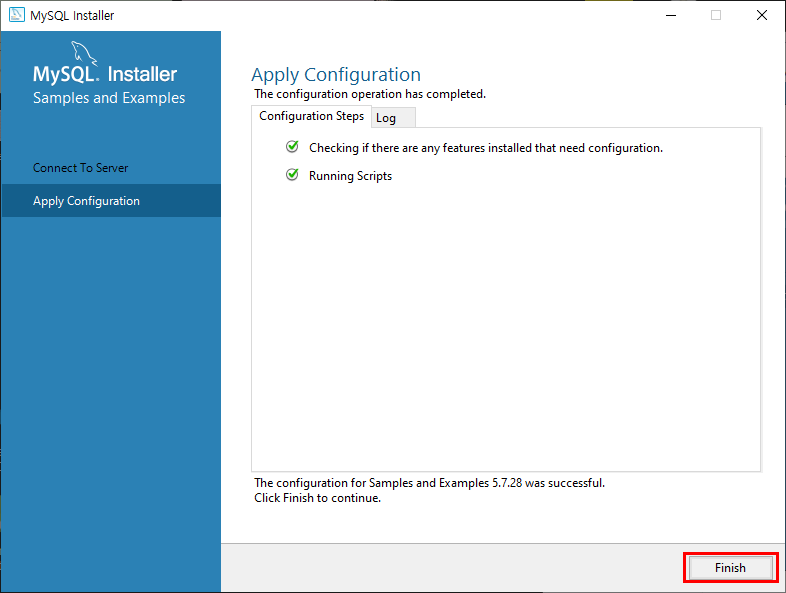

#### 2020-01-07

# Django와 MySQL 연동

## 1. MySQL 설치하기

제일먼저, [https://www.mysql.com/](https://www.mysql.com/) MySQL 사이트로 들어간다.

DOWNLOADS를 클릭해준다.

스크롤을 내려 MySQL Communitiy (GPL) Downloads 를 클릭한다.

MySQL Installer for Windows 를 클릭해준다.

그러면, 아래의 화면이 나올 것인데 최신버전보단 구버전을 깔기위해서 Looking for previous GA versions? 를 클릭해준다.

아래의 화면이 뜨면 두번째의 493.0M의 다운로드를 클릭한다.

다운로드를 클릭하면 아래의 화면이 뜨게 될텐데 No thanks, just start my download 를 클릭하면 다운로드가 시작될 것이다.

다운로드가 완료된 파일을 클릭한다.

클릭하면 아래의 화면이 뜰 것이다.

이 창이 꺼지게 되면 아래와 같은 새로운 화면이 뜨게 된다. Developer Default 를 선택하고 Next를 클릭해준다.

Execute 누르면 모든 해당 목록 파일들이 설치가 된다.

설치를 하는 중간에 아래의 화면이 뜨면 설치를 해준다.

설치가 완료되면 close를 누르고 다른 파일들이 설치되기를 기다린다.

설치가 되고있는 중간에 아래와 같은 화면이 뜨게된다. 이거도 설치해주자.

finish를 눌러준다.

아래의 화면이 뜰텐데 next를 눌러준다.

위에 사진을 보면 MySQL for Visual Studio 2.0.5는 설치가 안된게 보일 것이다. 

밑에 사진에서 알람창은 설치 누락된게 있는데 설치할거냐 라고 물어보는 것이다. 당연히 Yes를 클릭해준다.

그러면 아래와 같은 화면이 뜨게 된다. 이 창에서도 Execute를 클릭해서 설치를 해준다.

설치가 되고있는 창의 화면이다.

설치가 완료되면 Next를 클릭해준다.

또 Next를 눌러준다.

이번에도 기본으로 체크되어있는거 그대로 두고 Next를 눌러준다.

MySQL default 포트번호 3306 확인하기!! 기본값으로 사용하는걸 추천!! Next를 눌러준다.

아래 사진은 root 계정(관리자 계정)의 비밀번호를 설정하는 화면이다.(비밀번호는 잊어버리면 안된다!!!) 본인이 기억하기 쉬운 비밀번호를 입력하고 Next를 클릭한다.

Next를 눌러준다.

이 창에서도 Execute를 클릭해서 설치를 해준다.

설치가 진행중인 화면이다.

Finish를 눌러준다.

설치가 끝난 줄 알았지만 끝난게 아니였다... Next를 눌러준다.

Finish를 눌러준다.

Next를 눌러준다.

비밀번호를 입력한 후Check를 눌러 확인한 후 Next를 눌른다.

이 창에서도 Execute를 클릭해서 설치를 해준다.

설치가 완료되면 Finish를 눌러준다.

Next를 눌러준다.

드디어 설치가 완료되었다..

밑의 화면에 보이는 체크박스 2개를 선택된 상태로 Finish버튼을 누르면 Workbench 툴 과 Shell 이 실행된다.

윈도우에서 MySQL 5.7 Command Line Client 프로그램이 있을거다. 실행을 시켜준다. 설치할 때 지정했던 Root 계정 비밀번호를 입력 후 접속한다.

`select version();`를 입력해서 버전을 확인한다.

버전이 잘나오는 것을 확인했다!! 설치성공!!!

## 2. MySQL 환경변수 설정

MySQL 을 설치를 완료 했으면 환경변수 설정을 한다. 

나는 Workbeanch 를 사용하기 때문에 안해도 되지만 **환경변수를 설정하면 컴퓨터 어떤 경로에서라도 접근할 수 있어 cmd창으로도 바로 접근가능**하다.

MySQL 이 설치된 경로를 찾는다. bin폴더까지 

내 PC 를 마우스 우클릭해서 속성으로 들어간다.

고급 시스템 설정 클릭한다.

환경변수를 클릭한다.

path 를 선택한 후 편집을 누른다.

새로운 경로를 지정 할 수있도록 새로만들기를 클릭한다.

처음에 설치된 경로를 복사 붙여넣기하고 확인을 눌러준다.

`C:\Program Files\MySQL\MySQL Server 5.7\bin`

확인누르고 또 확인누르면 설정완료!

cmd 창에서 mysql 버전을 확인해보도록하자. mysql -V 입력

버전이 잘뜨면 성공!! 설치 끝!!

## 3. Django와 MySQL 연동

[참고사이트](http://pythonstudy.xyz/python/article/201-Python-DB-API)

 Django는 default 데이터베이스로 SQLite3를 사용한다. SQLite3는 용량이 작고 가볍지만 대규모 프로젝트에서는 잘 쓰이지 않는다.

또한 MySQL이 기본적으로 제공하는 Workbench라는 툴을 이용하면 데이터베이스를 더 쉽게 사용하고 관리할 수 있어 굉장히 편리하다.

MySQL과 Workbench는 위에서 설치하였다.

