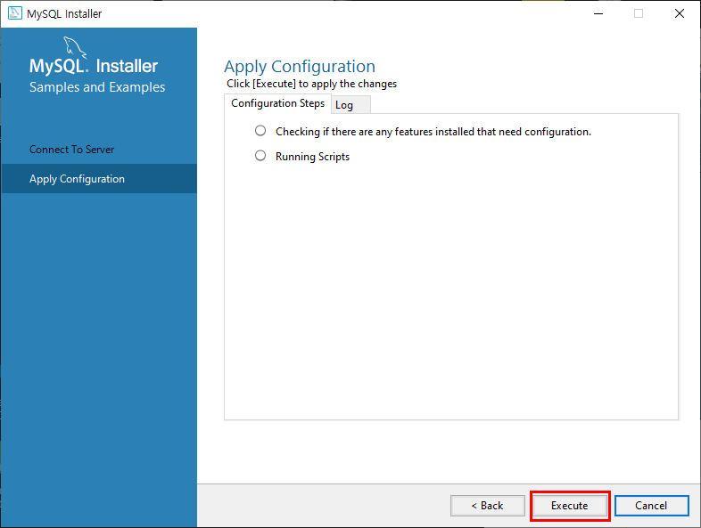
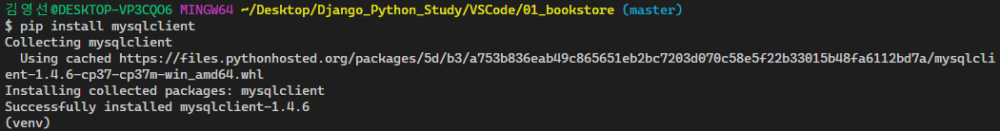

#### 2020-01-07

# Django와 MySQL 연동


## 1. MySQL 설치하기

제일먼저, [https://www.mysql.com/](https://www.mysql.com/) MySQL 사이트로 들어간다.

DOWNLOADS를 클릭해준다.

스크롤을 내려 MySQL Communitiy (GPL) Downloads 를 클릭한다.


MySQL Installer for Windows 를 클릭해준다.


그러면, 아래의 화면이 나올 것인데 최신버전보단 구버전을 깔기위해서 Looking for previous GA versions? 를 클릭해준다.


아래의 화면이 뜨면 두번째의 493.0M의 다운로드를 클릭한다.


다운로드를 클릭하면 아래의 화면이 뜨게 될텐데 No thanks, just start my download 를 클릭하면 다운로드가 시작될 것이다.


다운로드가 완료된 파일을 클릭한다.


클릭하면 아래의 화면이 뜰 것이다.


이 창이 꺼지게 되면 아래와 같은 새로운 화면이 뜨게 된다. Developer Default 를 선택하고 Next를 클릭해준다.


Execute 누르면 모든 해당 목록 파일들이 설치가 된다.


설치를 하는 중간에 아래의 화면이 뜨면 설치를 해준다.


설치가 완료되면 close를 누르고 다른 파일들이 설치되기를 기다린다.


설치가 되고있는 중간에 아래와 같은 화면이 뜨게된다. 이거도 설치해주자.


finish를 눌러준다.


아래의 화면이 뜰텐데 next를 눌러준다.


위에 사진을 보면 MySQL for Visual Studio 2.0.5는 설치가 안된게 보일 것이다. 

밑에 사진에서 알람창은 설치 누락된게 있는데 설치할거냐 라고 물어보는 것이다. 당연히 Yes를 클릭해준다.


그러면 아래와 같은 화면이 뜨게 된다. 이 창에서도 Execute를 클릭해서 설치를 해준다.


설치가 되고있는 창의 화면이다.


설치가 완료되면 Next를 클릭해준다.


또 Next를 눌러준다.


이번에도 기본으로 체크되어있는거 그대로 두고 Next를 눌러준다.


MySQL default 포트번호 3306 확인하기!! 기본값으로 사용하는걸 추천!! Next를 눌러준다.


아래 사진은 root 계정(관리자 계정)의 비밀번호를 설정하는 화면이다.(비밀번호는 잊어버리면 안된다!!!) 본인이 기억하기 쉬운 비밀번호를 입력하고 Next를 클릭한다.


Next를 눌러준다.


이 창에서도 Execute를 클릭해서 설치를 해준다.


설치가 진행중인 화면이다.


Finish를 눌러준다.


설치가 끝난 줄 알았지만 끝난게 아니였다... Next를 눌러준다.


Finish를 눌러준다.


Next를 눌러준다.


비밀번호를 입력한 후Check를 눌러 확인한 후 Next를 눌른다.


이 창에서도 Execute를 클릭해서 설치를 해준다.



설치가 완료되면 Finish를 눌러준다.


Next를 눌러준다.


드디어 설치가 완료되었다..

밑의 화면에 보이는 체크박스 2개를 선택된 상태로 Finish버튼을 누르면 Workbench 툴 과 Shell 이 실행된다.


Workbench에서 설치성공 확인하는법


윈도우에서 MySQL Workbench 8.0 CE 를 클릭한다. 그러면 아래와 같은 창이 뜰 것이다.


MySQL Connections 에있는 Local instance MySQL57을 클릭해준다. 그러면 비밀번호를 입력할 수 있는 창이 뜰것이다. 비밀번호를 입력하고 ok 버튼을 클릭해준다.


아래의 화면이 뜨게 되면 설치,연결 성공이다.!!


또 다른 확인 방법 

윈도우에서 MySQL 5.7 Command Line Client 프로그램이 있을거다. 실행을 시켜준다. 설치할 때 지정했던 Root 계정 비밀번호를 입력 후 접속한다.


`select version();`를 입력해서 버전을 확인한다.


버전이 잘나오는 것을 확인했다!! 설치성공!!!


## 2. MySQL 환경변수 설정

MySQL 을 설치를 완료 했으면 환경변수 설정을 한다. 

나는 Workbeanch 를 사용하기 때문에 안해도 되지만 **환경변수를 설정하면 컴퓨터 어떤 경로에서라도 접근할 수 있어 cmd창으로도 바로 접근가능**하다.

MySQL 이 설치된 경로를 찾는다. bin폴더까지 


내 PC 를 마우스 우클릭해서 속성으로 들어간다.


고급 시스템 설정 클릭한다.


환경변수를 클릭한다.


path 를 선택한 후 편집을 누른다.


새로운 경로를 지정 할 수있도록 새로만들기를 클릭한다.


처음에 설치된 경로를 복사 붙여넣기하고 확인을 눌러준다.

`C:\Program Files\MySQL\MySQL Server 5.7\bin`


확인누르고 또 확인누르면 설정완료!

cmd 창에서 mysql 버전을 확인해보도록하자. mysql -V 입력


버전이 잘뜨면 성공!! 설치 끝!!


#### 2020-01-09

## 3. Django와 MySQL 연동

[참고사이트](http://pythonstudy.xyz/python/article/201-Python-DB-API)

 Django는 default 데이터베이스로 SQLite3를 사용한다. SQLite3는 용량이 작고 가볍지만 대규모 프로젝트에서는 잘 쓰이지 않는다.

또한 MySQL이 기본적으로 제공하는 Workbench라는 툴을 이용하면 데이터베이스를 더 쉽게 사용하고 관리할 수 있어 굉장히 편리하다.

MySQL과 Workbench는 위에서 설치하였다.

### 3.1 mysqlclient 설치

Python에서 MySQL을 사용하기 위해 우선 Python DB API 표준을 따르는 MySQL DB 모듈을 설치해야 한다.

MySQL을 지원하는 Python 모듈은 여러 가지가 있는데, 여기서는 `mysqlclient` 라는 모듈을 사용할 것이다.

일단 `VSCode`에서`01_bookstore`프로젝트에서 실행할것이다.

```bash
$ pip install mysqlclient
```



### 3.2 settings.py 코드 수정

현재 settings.py의 데이터베이스 부분에는 아래의 코드처럼 default 데이터베이스인 SQLite3로 지정되어 있다.

```python
# Database
# https://docs.djangoproject.com/en/2.1/ref/settings/#databases

DATABASES = {
    'default': {
        'ENGINE': 'django.db.backends.sqlite3',
        'NAME': os.path.join(BASE_DIR, 'db.sqlite3'),
    }
}
```

이 부분에 우리가 사용할 MySQL에 대한 정보를 입력해주어야 한다. 입력할 항목은 아래와 같다.

```python
# MySQL
DATABASES = {
    'default': {
        'ENGINE': 'django.db.backends.mysql',
        'NAME': 'bookstore',
        'USER': 'root',
        'PASSWORD': 'password',
        'HOST': 'localhost',
        'PORT': '3306',
    }
}
```

- `ENGINE: 'django.db.backends.mysql' `: MySQL 엔진 설정
- `'NAME'` : 연결할 데이터베이스(스키마) 이름
- `'USER'` : 사용할 데이터베이스 계정
  - root는 MySQL의 최상위 계정으로 MySQL을 설치할 때 함께 만들었다.
- `'PASSWORD'`: 사용할 계정에 대한 패스워드
- `'HOST'` : 데이터베이스 주소(IP)
  - 우리는 PC에 설치된 MySQL을 사용하는 것이므로 localhost로 지정
- `'PORT'` : 데이터베이스 포트 번호
  - MySQL은 3306이 default

### 3.3 MySQL 스키마 생성

MySQL에서는 데이터베이스를 스키마라고도 합니다. 아까 settings.py에서 연결할 데이터베이스의 이름을 `bookstore`라고 지정했지만 아직 MySQL에는 `bookstore`라는 데이터베이스가 존재하지 않는다. 따라서 이를 만들어줘야 한다.

먼저 workbench에서 local instance를 선택하여 들어간다.


로그인하면 다음과 같은 화면이 나온다. SQL 쿼리문을 입력하여 직접 스키마를 생성할 수도 있지만 그냥 스키마 리스트가 나열된 곳에 마우스 우클릭을 하면 스키마를 쉽게 생성할 수 있다.


스키마 이름은 settings.py에서 지정한 이름으로, 나머지 항목은 다음과 같이 지정한 후 아래에 있는`apply` 버튼을 눌러 스키마를 생성한다.


그러면 왼쪽에 `bookstore` 스키마가 생긴 것을 확인할 수 있다.

### 3.4 데이터베이스 변경사항 반영

현재 bookstore 데이터베이스는 초기화 상태이다. 지금까지 작업한 내용을 반영하기 위해 아래의 명령어로 데이터베이스에 변경사항을 반영한다.

```bash
$ python manage.py migrate
```

migrate가 성공하고 workbench에서 bookstore 데이터베이스를 확인해보면 아래의 화면과 같이 Django가 기본적으로 만들어주는 테이블 외에도 models.py에 정의한 book 테이블까지 생성된 것을 확인할 수 있다.


### 3.5 Admin 계정 생성 및 데이터 입력

migrate를 다시 한 것과 마찬가지로 settings.py에서 데이터베이스 부분을 새로 설정하여 초기화된 상태이기 때문에 Admin 계정 또한 다시 생성해야 한다.

```bash
$ python manage.py createsuperuser
```

생성한 Admin 계정으로 로그인하여 Admin 페이지를 들어가보면


Book 테이블에 아무런 데이터가 없는 것을 확인할 수 있다.

이전에 했던 것처럼 Book 테이블에 데이터를 추가하면 아래 Admin 페이지에서 보이는 것처럼


 workbench의 book 테이블에도 데이터가 INSERT 된 것을 확인할 수 있다.


## 4. Git 올릴때 문제 해결하기

- MySql 연동 관련 모듈설치

```bash
#가상환경 내에서 설치
$ pip install mysql-connector
$ pip install django-mysql
$ pip install mysqlclient
$ pip install python-decouple
```

하지만 이대로 프로젝트를 GitHub에 올리게 되면 `settings.py`에 직접 지정한 MySQL에 대한 정보가 다 올라가게 된다. 보안상의 문제가 생길수 있으니 별도의 파일에서 설정들을 불러와 입력할 수 있게 수정할 것이다. 

별도의 파일에서 설정정보를 불러오는 방법을 사용해 볼 것이다. `cnf`라는 확장자를 가진 파일을 만들어 그안에 아래 와 같이 입력해준다.

`mysql.cnf`

```cnf
[client]
database = DB명
host = 데이테베이스 주소(IP)
port = 데이터베이스 port설정
user = 데이터베이스 계정 id
password = mysql 계정 비밀번호
```

그 다음, 위의 파일을 settings.py에서 아래와 같이 불러와 적용시켜준다.

```python
DATABASES = {
    'default': {
        'ENGINE': 'django.db.backends.mysql',
        'NAME': 'bookstore', # mysql db계정
        'OPTIONS': {
            'read_default_file': os.path.join(BASE_DIR, 'mysql.cnf'),
        }
    }
}
```


 