#### 2020-01-09,14

# DKEA(Shoppingmall)_숙제

## 1. 구성	

### 1.1 UI 구성하기

`127.0.0.1:8080`서버에 접속하면 바로 main_page가 뜨게끔 하기


의류버튼을 누르면 의류에 해당하는 상의,하의메뉴가 하단에 뜨게 하기 


서브메뉴 중 상의를 클릭하게되면 해당상의에 옷의 정보 및 가격을 보여주기

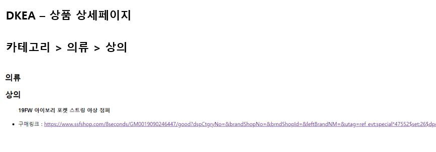

### 1.2 테이블 구성하기

- Category 테이블

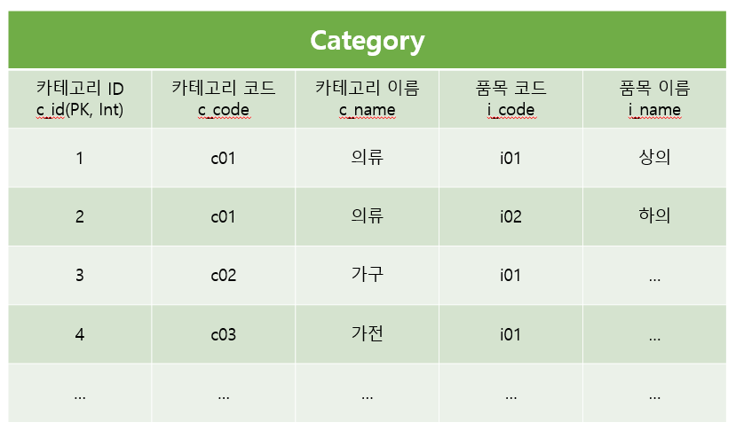

- Product 테이블

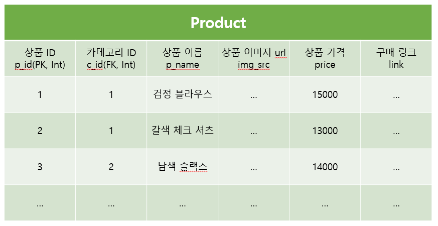

## 2. 개발

### 2.1 `02_DKEA` 폴더 생성

```bash
$ mkdir 02_DKEA
```

### 2.2 프로젝트 생성

```bash
$ django-admin startproject config .
```

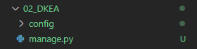

### 2.3 애플리케이션 생성 및 등록

```bash
$ python manage.py startapp DKEA
```

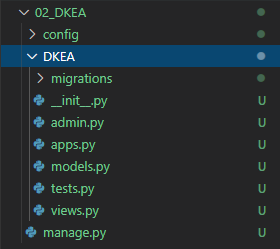

```python
# settings.py

INSTALLED_APPS = [
    ...
    'DKEA',
]
```

### 2.4 Templates 경로 설정 및 언어 설정

```python
# settings.py	
TEMPLATES = [
    {
        ...
        'DIRS': [os.path.join(BASE_DIR, 'config', 'templates')],
        ...
    },
]
```

경로를 설정해 주었으면 config 폴더안에 templates 폴더를 생성해준다.

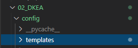

```python
# settings.py
LANGUAGE_CODE = 'ko-kr'

TIME_ZONE = 'Asia/Seoul'
```

### 2.5 데이터베이스 MySQL로 변경

`settings.py`에서 `sqlite3`로 연결 되어있던 부분을 주석처리해주고 `mysql`을 연결해주는 코드를 작성해준다.

```python
# Database
# https://docs.djangoproject.com/en/2.2/ref/settings/#databases

# DATABASES = {
#     'default': {
#         'ENGINE': 'django.db.backends.sqlite3',
#         'NAME': os.path.join(BASE_DIR, 'db.sqlite3'),
#     }
# }

# MySQL
DATABASES = {
    'default': {
        'ENGINE': 'django.db.backends.mysql',
        'NAME': 'dkea',
        'USER': 'root',
        'PASSWORD': '설정한비번적어주기',
        'HOST': 'localhost',
        'PORT': '3306',
    }
}
```

### 2.6 Model 설계하기

```python
from django.db import models

# Create your models here.
class Category(models.Model):
    c_id = models.IntegerField(primary_key=True)
    c_code = models.CharField(max_length=100, blank=True, null=True)
    c_name = models.CharField(max_length=100, blank=True, null=True)
    i_code = models.CharField(max_length=100, blank=True, null=True)
    i_name = models.CharField(max_length=100, blank=True, null=True)

    def __str__(self):
        return f'[{self.c_code}] : [{self.i_name}]'


class Product(models.Model):
    p_id = models.IntegerField(primary_key=True)
    c = models.ForeignKey(Category, models.DO_NOTHING)
    p_name = models.CharField(max_length=45, blank=True, null=True)
    img_src = models.URLField(unique=True)
    price = models.IntegerField(null=True, blank=True)
    link = models.URLField(unique=True)

    def __str__(self):
        return f'[{self.c_id}] : [{self.p_name}]'
```

```bash
$ python manage.py makemigrations
$ python manage.py migrate
```

만든 모델을 반영시켜주면 `MySQL Workbench`에 `Category`,`Product` 테이블이 생성된 것을 볼수 있다.

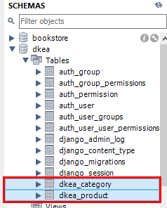

##### 관리자 생성하기

```bash
$ python manage.py createsuperuser
```

데이터를 입력할 수 있는 방법은 `관리자 페이지`에서 등록하는 것과 `MySQL Workbench`에서 등록하는 방법이 있다.

일단 두 방법을 써서 데이터를 입력해 주었다.

- Category 테이블

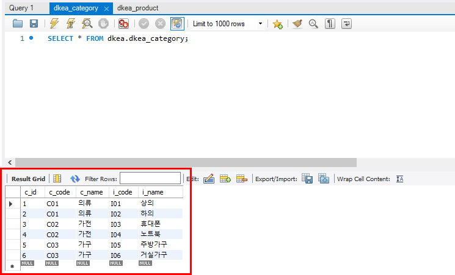

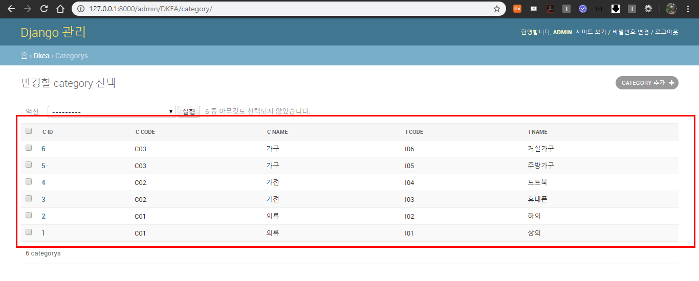

- Product 테이블

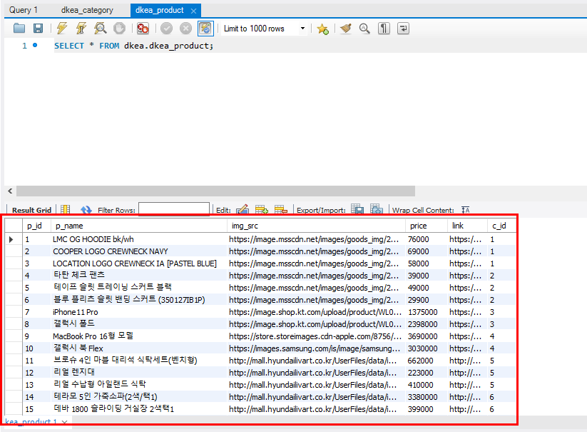

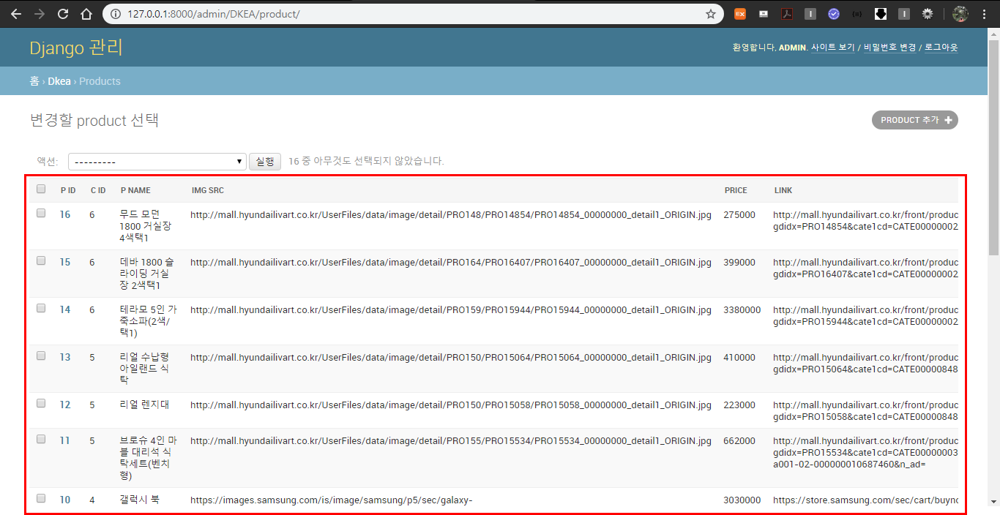

##### 만약, MySQL에서 테이블을 만든 경우

MySQL에서 데이터 값을 입력한경우 아래의 명령어를 입력하여 테이블들을 불러온다.

```bash
$ python manage.py inspectdb
```

### 2.7 URL 연결

#### 2.7.1 config/urls.py

`config/urls.py`에서는 `http://127.0.0.1:8000/`로 들어가면 바로 main_page가 뜨게 할꺼고 `DKEA/urls.py`와 연결해 주도록 할꺼다.

```python
# config/urls.py

from django.contrib import admin
from django.urls import path, re_path, include
from DKEA import views as DKEA_views

urlpatterns = [
    re_path(r'^admin/', admin.site.urls),
    re_path(r'^$', DKEA_views.DKEA_main, name='main'),
    re_path(r'^DKEA/', include('DKEA.urls')),
]
```

#### DKEA/urls.py

```python
# DKEA/urls.py


```

### 2.8 View


### 2.9 Templates


