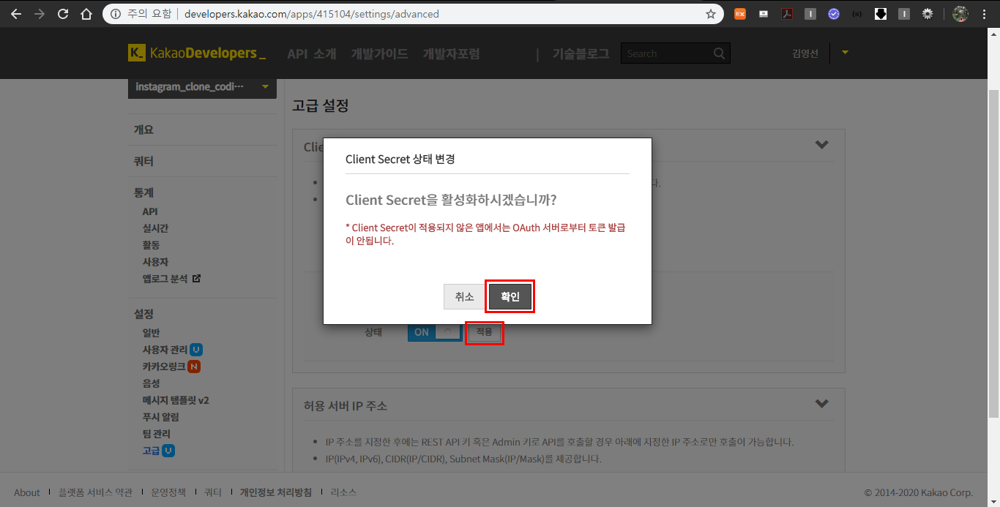
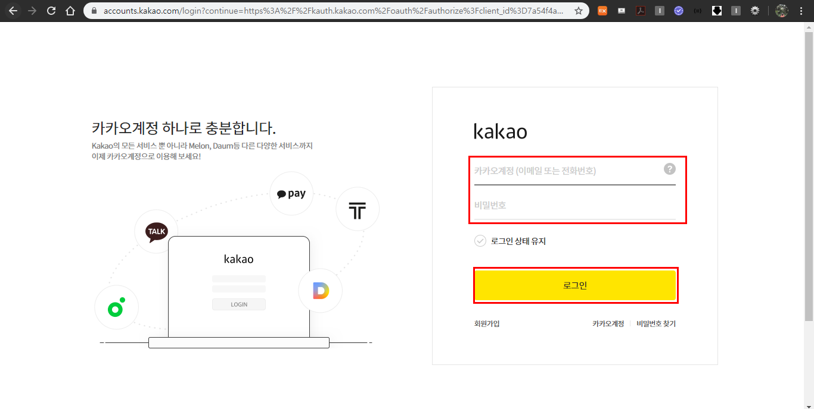

#### 2020.03.28 

# Social Login(Kakao)

> 인증,계정,등록 등을 다루는 여러가지 방법이 존재하는데, **`django-allauth`라는 라이브러리를 사용해서 손쉽게 Social Login을 구현해보자.**
>
> `django-allauth`는 대부분의 소셜 로그인을 지원하고 회원가입을 시킬 수 있다.

## 0. 사전준비

사용설명 : https://django-allauth.readthedocs.io/en/latest/installation.html 보면서 해보자!

### 0.1 django-allauth 라이브러리 설치

```bash
$ pip install django-allauth
```


```bash
$ pip list
```

설치목록을 보면 `django-allauth`가 설치된 것을 확인할 수 있다.


### 0.2 settings.py 코드 추가

```python
# config/settings.py 

AUTHENTICATION_BACKENDS = (
    # Needed to login by username in Django admin, regardless of `allauth`
    'django.contrib.auth.backends.ModelBackend',
)

INSTALLED_APPS = [
    ...
    'django.contrib.sites',
    'allauth',
    'allauth.account',
    'allauth.socialaccount',
    'allauth.socialaccount.providers.kakao',
   	...
]

SITE_ID = 1

...
# 로그인 후 리다이렉트 경로
LOGIN_REDIRECT_URL ='instagram:main'
```

### 0.3 config/urls.py 코드 추가

```python
# config/urls.py

from django.contrib import admin
from django.urls import path, re_path, include

urlpatterns = [
    ...
    # 기존의 accounts url 연결
    re_path(r'^accounts/', include('accounts.urls')),
    # 추가한 accounts url 연결
    re_path(r'^accounts/', include('allauth.urls')),
    ...
]
```

### 0.4 마이그레이트(migrate)

```bash
$ python manage.py migrate
```


마이그레이트를 하기 전 `MySQL Workbench`를 보면 아래와 같이 기존의 테이블 들을 볼수 있다.


하지만 마이그레이트를 한 뒤 테이블을 보면 새로운 테이블들이 생성된 것을 확인할 수 있다.


### 0.5 설치 확인

`http://127.0.0.1:8000/accounts/` 로 접속하면 새로운 URL이 등록된것을 확인할 수 있다.

## 1. Admin 페이지에서 확인하기

### 1.1 superuser 생성

```bash
$ python manage.py createsuperuser
```

`http://127.0.0.1:8000/admin` admin 페이지에 들어가면 새로운 계정, 사이트, 소셜 계정이 생성된 것을 확인 할 수 있다.


## 2. Kakao Developer `OAuth`등록

우선, [https://developers.kakao.com/](https://developers.kakao.com/) 사이트를 들어간다.

로그인을 클릭해서 카카오계정으로 로그인을 한다.


로그인이 되었으면 이름 옆에 화살표를 클릭하면 메뉴가 뜨는데 

`내 애플리케이션`을 클릭한다.


### 2.1 앱 만들기

개발가이드 [https://developers.kakao.com/docs/restapi](https://developers.kakao.com/docs/restapi)

`앱 만들기`를 클릭한다.


앱 이름과 회사명을 입력해준 뒤 `앱 만들기`를 클릭한다.(앱 이름과 회사명은 알아서 작성해준다.)


나는 앱 아이콘은 등록을 안했기 때문에 아래와 같은 창이 뜨게 된다. 등록은 안해도 상관없으므로 계속진행을 클릭한다.


그러면 내가 지정한 이름으로 만들어진 앱이 생성된다. 그리고 4가지의 키들이 발급되어진다.

 

### 2.2 플랫폼 추가해주기

설정 > 일반 으로 클릭해 들어가서 플랫폼 추가를 클릭한다.


웹을 클릭한 뒤`http://127.0.0.1:8000`와 `https://127.0.0.1:8000`를 입력하고 추가를 클릭한다.


그러면 `저장되었습니다`라는 알람창이 뜬다.


### 2.3 사용자 관리 설정 변경

설정 > 사용자관리 로 들어가서 off 를 on으로 변경해준다.


`로그인 동의항목`에서 카카오계정을 on으로 변경해주고 프로필정보와 카카오계정의 수집목적을 입력해준다.


입력을 다해주었으면 아래의 저장버튼을 클릭한다.


저장이 된 다음에 `로그인 Redirect URI`에서 `http://127.0.0.1:8000/accounts/kakao/login/callback/` 주소를 추가 한 다음 저장버튼을 클릭한다.


그러면 `저장되었습니다`라는 알람창이 뜬다.


### 2.4 admin 페이지의 소셜 어플리케이션에 카카오 로그인 추가하기


소셜 어플리케이션에 들어간 뒤 소셜 어플리케이션 추가 버튼을 클릭해 준다.


그러면 아래와 같은 화면이 보이게 된다.


아래와 같이 입력해준다.


클라이언트 아이디는 카카오에서 발급받은 REST API 키를 작성해주면 되고 비밀키는 설정 > 고급에 들어가 Client Secret 키를 발급 받아 작성해준다.

Sites에서는 example.com을 화살표 방향으로 이동시켜줘야한다.(의미X, 로컬주소 넣어줘도 됨, default값이하나 필요해서 하나 옮긴거다!)

**비밀키 가져오는 방법** 

`설정 > 고급`

나는 코드를 이미 발급받아서 코드가 나와있는데 발급 버튼을 클릭해서 코드를 발급받고 상태를 off에서 on으로 변경해준다. 


적용버튼을 클릭한 뒤 활성화 버튼을 클릭해준다.

이렇게 입력한 정보들을 저장버튼을 눌러 저장한다. 그럼 아래와같이 저장될 것이다.


## 3. template 변경

사이트 참고 [https://django-allauth.readthedocs.io/en/latest/templates.html](https://django-allauth.readthedocs.io/en/latest/templates.html)

templates/accounts/login.html 수정

카카오 로그인 버튼을 추가해준다!! css도 수정 완료

```django
...

...
<hr>
<!-- 카카오 로그인 -->
<a href="" class="btn" id="kakao_login">
  
</a>
...
```


## 4. 연결 테스트


카카오 로그인 버튼을 누르면 아래와 같은 카카오 로그인 화면이 뜬다. 카카오 계정을 입력하고 로그인버튼을 누른다.



로그인을 하면 아래와 같은 화면이 뜨게 된다.


전체 동의하기를 클릭하고 동의하고 계속하기를 클릭한다.


에러가 발생했다... 


에러를 해결하기 위해서 instagram/urls.py에서 <user_id>와 <following_id>가 있는 부분에 정규표현식에 한글을 인식할 수 있는 `ㄱ-힣`을 추가해 수정한다.

 ```python
...
re_path(r'^(?P<user_id>[ㄱ-힣a-zA-Z0-9-_.]*)/$', PostListView, name='post_list'),
...
re_path(r'^follow/(?P<following_id>[ㄱ-힣a-zA-Z0-9-_.]*)/$', FollowView, name='follow'),
    re_path(r'^unfollow/(?P<following_id>[ㄱ-힣a-zA-Z0-9-_.]*)/$', UnfollowView, name='unfollow'),
...
 ```

코드를 고친구 새로고침을 해주면!!!

카카오 계정으로 로그인 하는 것을 성공하였다!!!


프로필편집에 들어가보면 카카오 메일이 뜨는 것도 확인 할 수 있다!!


MySQL Workbench에서도 카카오계정의 유저가 추가된것을 확인할 수 있다.


