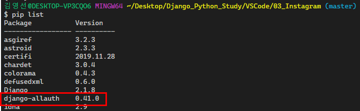
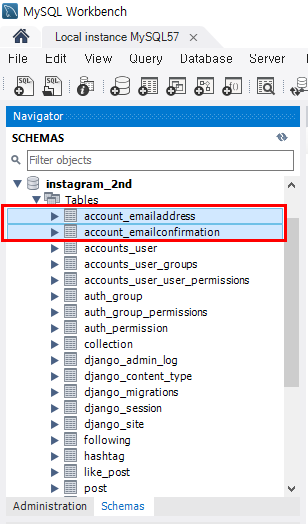
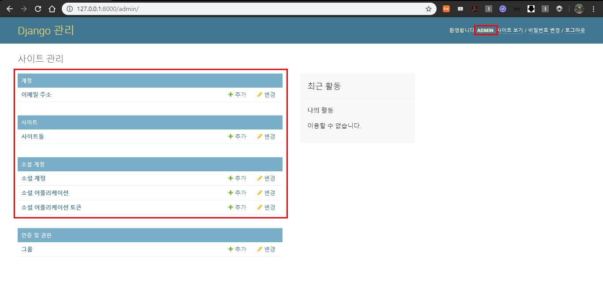
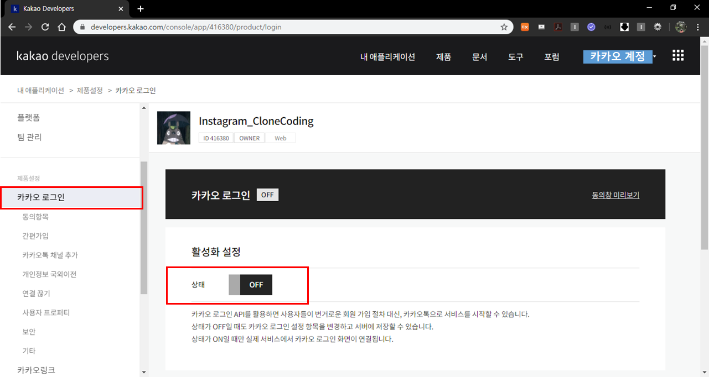
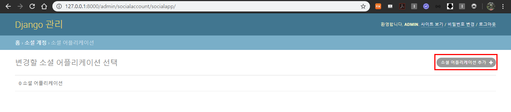
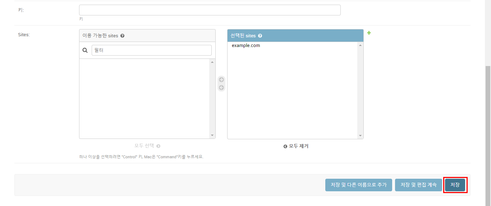
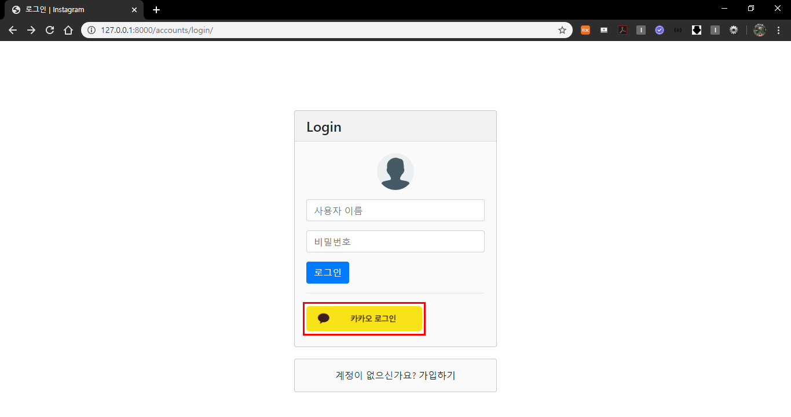
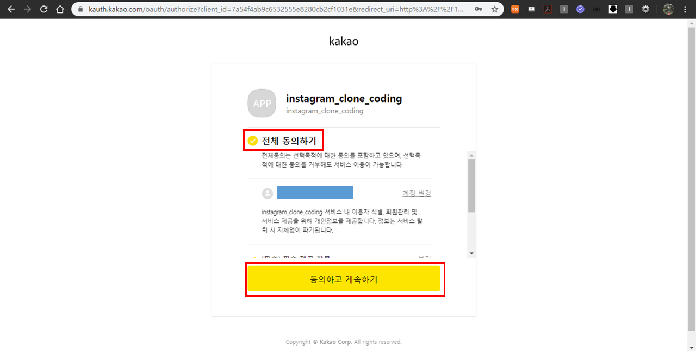
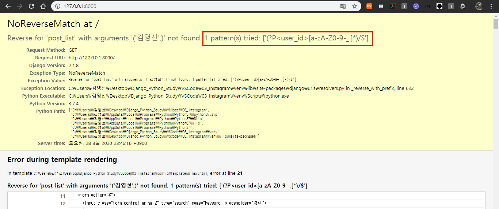
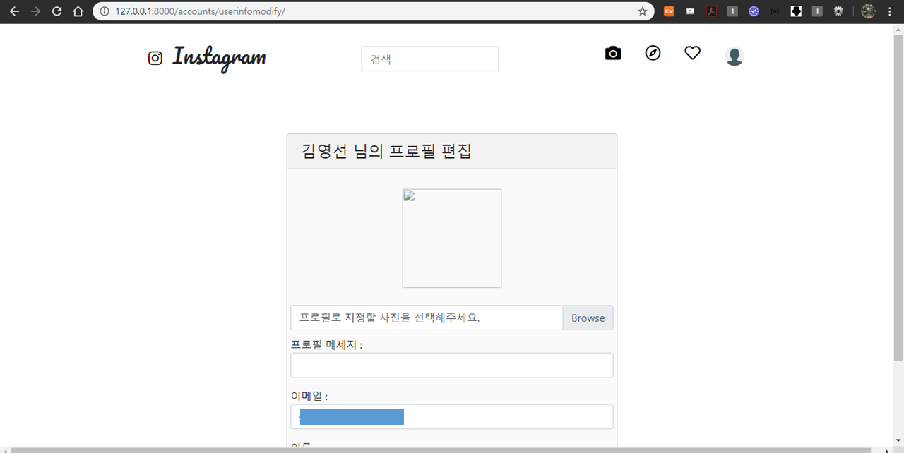

#### 2020.04.01 

# Social Login(Kakao)

***https://developers.kakao.com/ 사이트가 업뎃이 되어서 2번 항목 수정***

> 인증,계정,등록 등을 다루는 여러가지 방법이 존재하는데, **`django-allauth`라는 라이브러리를 사용해서 손쉽게 Social Login을 구현해보자.**
>
> `django-allauth`는 대부분의 소셜 로그인을 지원하고 회원가입을 시킬 수 있다.

## 0. 사전준비

사용설명 : https://django-allauth.readthedocs.io/en/latest/installation.html 보면서 해보자!

### 0.1 django-allauth 라이브러리 설치

```bash
$ pip install django-allauth
```


```bash
$ pip list
```

설치목록을 보면 `django-allauth`가 설치된 것을 확인할 수 있다.



### 0.2 settings.py 코드 추가

```python
# config/settings.py 

AUTHENTICATION_BACKENDS = (
    # Needed to login by username in Django admin, regardless of `allauth`
    'django.contrib.auth.backends.ModelBackend',
)

INSTALLED_APPS = [
    ...
    'django.contrib.sites',
    'allauth',
    'allauth.account',
    'allauth.socialaccount',
    'allauth.socialaccount.providers.kakao',
   	...
]

# 디폴트 SITE의 id / 등록을 하지 않으면, 각 요청 시에 host명의 Site 인스턴스를 찾는다 .
SITE_ID = 1

...
# django-allauth setting
LOGIN_REDIRECT_URL ='instagram:main' # 로그인 후 리다이렉트 할 페이지
ACCOUNT_LOGOUT_REDIRECT_URL = 'accounts:login'  # 로그아웃 후 리다이렉트 할 페이지
ACCOUNT_LOGOUT_ON_GET = True # 로그아웃 버튼 클릭 시 자동 로그아웃
```

### 0.3 config/urls.py 코드 추가

```python
# config/urls.py

from django.contrib import admin
from django.urls import path, re_path, include

urlpatterns = [
    ...
    # 기존의 accounts url 연결
    re_path(r'^accounts/', include('accounts.urls')),
    # 추가한 accounts url 연결
    re_path(r'^accounts/', include('allauth.urls')),
    ...
]
```

### 0.4 마이그레이트(migrate)

```bash
$ python manage.py migrate
```


마이그레이트를 하기 전 `MySQL Workbench`를 보면 아래와 같이 기존의 테이블 들을 볼수 있다.


하지만 마이그레이트를 한 뒤 테이블을 보면 새로운 테이블들이 생성된 것을 확인할 수 있다.




### 0.5 설치 확인

`http://127.0.0.1:8000/accounts/` 로 접속하면 새로운 URL이 등록된것을 확인할 수 있다.

## 1. Admin 페이지에서 확인하기

### 1.1 superuser 생성

```bash
$ python manage.py createsuperuser
```

`http://127.0.0.1:8000/admin` admin 페이지에 들어가면 새로운 계정, 사이트, 소셜 계정이 생성된 것을 확인 할 수 있다.



## 2. Kakao Developer `OAuth`등록

**사이트 업뎃되서 수정했습니다.**

우선,  [https://developers.kakao.com/](https://developers.kakao.com/) 사이트를 들어간다.

로그인을 클릭해서 카카오계정으로 로그인을 한다.


로그인이 되었으면 카카오계정이 뜨게 되는데 이메일 좌측에 있는 `내 애플리케이션` 메뉴를 클릭한다.


### 2.1 애플리케이션 만들기

개발가이드 [https://developers.kakao.com/docs/latest/ko/kakaologin/rest-api](https://developers.kakao.com/docs/latest/ko/kakaologin/rest-api)

`애플리케이션 추가하기`를 클릭한다.


앱아이콘, 앱 이름, 회사 이름을 입력해준 뒤 저장을 클릭한다.(앱 이름과 회사이름은 각자 알아서 작성해준다.)


저장을 누르게 되면 내가 지정한 이름으로 만들어진 애플리케이션이 생성된다.


**내 애플리케이션 > 앱 설정 > 요약정보**

만들어진 해당 애플리케이션을 클릭해서 들어가보면 4개의 앱키가 발급되어진 것을 볼 수 있다. 


### 2.2 플랫폼 추가해주기

**내 애플리케이션 > 앱 설정 > 플랫폼**


해당 페이지에서 스크롤을 내려서 `Web 플랫폼 등륵`을 클릭한다.

`http://127.0.0.1:8000`와 `https://127.0.0.1:8000`를 입력하고 저장을 클릭한다.


그러면 저장된 사이트 도메인들을 확인할 수 있다.


### 2.3 카카오 로그인 활성화(사용자 관리 설정 변경)

**내 애플리케이션 > 제품설정 > 카카오 로그인**

위의 경로로 들어가면 아래의 화면과 같이 카카오 로그인이 off 가 되어있고 활성화 설정 상태가 off 가  된 것을 확인 할 수 있다.


활성화 설정의 상태를 on으로 바꿔주기 위해 off 부분을 클릭하면 아래의 화면처럼 활성화 창이 뜨게 된다. 카카오 로그인 활성화를 위해 저장을 클릭한다.


**하지만**,  활성화가 되지 않으며 **동의항목 > 개인정보 보호항목 > 프로필**을 설정하라는 메세지가 띄워지게 된다. 


이를 해결하기 위해, **제품설정 > 동의항목 > 개인정보 보호항목 > 프로필**을 설정해줄 것이다.


`개인정보 보호항목`에서 `프로필정보(닉네임/프로필 사진)`와 `카카오계정(이메일)`의 수집목적의 설정을 변경해준다.

**프로필정보(닉네임/프로필 사진)**

프로필정보(닉네임/프로필 사진)의 설정을 누른다.


동의항목 설정에서 **동의단계** `필수동의`를 선택해주고 **카카오 계정으로 정보 수집 후 제공** `사용자에게 값이 없는 경우 카카오 계정 정보 입력을 요청하여 수집`을 선택해주며 **동의 목적**에는 `소셜 로그인 테스트`를 입력해준 뒤 저장을 클릭한다.


성공적으로 설정이 반영되었다.


**카카오계정(이메일)**

카카오계정(이메일)의 설정을 누른다.


동의항목 설정에서 **동의단계** `선택동의`를 선택해주고 **카카오 계정으로 정보 수집 후 제공** `사용자에게 값이 없는 경우 카카오 계정 정보 입력을 요청하여 수집`을 선택해주며 **동의 목적**에는 `소셜 로그인 테스트`를 입력해준 뒤 저장을 클릭한다.


성공적으로 설정이 반영되었다.


**카카오 로그인 활성화**를 위한 위의 작업이 모두 끝났으면 **내 애플리케이션 > 제품설정 > 카카오 로그인** 으로 들어가서 `활성화 설정`을 off 에서 on으로 변경해준다.

 **off**

**on**


카카오 로그인 활성화를 성공했다.

활성화를 시킨 다음에 같은 화면에서 스크롤을 내려보면 `Redirect URI`를 확인 할 수 있다.

수정 버튼을 클릭해준다. 


`http://127.0.0.1:8000/accounts/kakao/login/callback/` 주소를 추가 한 다음 저장을 클릭한다. (이전에 입력한 주소 뒤에 `/oauth`가 자동으로 생성되었다.)


추가한 주소를 확인 해 볼 수 있다.

 

### 2.4 admin 페이지의 소셜 어플리케이션에 카카오 로그인 추가하기


소셜 어플리케이션에 들어간 뒤 소셜 어플리케이션 추가 버튼을 클릭해 준다.



그러면 아래와 같은 화면이 보이게 된다.


아래와 같이 입력해준다.


클라이언트 아이디는 카카오에서 발급받은 REST API 키를 작성해주면 되고 비밀키는 **내 애플리케이션 > 제품설정 > 카카오 로그인 > 보안**에 들어가 `Client Secret` 키를 발급 받아 작성해준다.

Sites에서는 example.com을 화살표 방향으로 이동시켜줘야한다.(의미X, 로컬주소 넣어줘도 됨, default값이하나 필요해서 하나 옮긴거다!)

**비밀키 가져오는 방법** 

**내 애플리케이션 > 제품설정 > 카카오 로그인 > 보안**

코드 생성 버튼을 클릭한다.


생성 버튼을 클릭한다.


그러면 아래와 같이 코드가 발급이되고 활성화 상태가 `사용안함`으로 설정되어있다.  


활성화 상태의 설정을 클릭해서 `사용함`으로 선택한 뒤 저장을 클릭한다.


그러면, 활성화 상태가 `사용함`으로 반영된 것을 확인할 수 있다.


-----------

이렇게 입력한 정보들을 저장버튼을 눌러 저장한다. 그럼 아래와같이 저장될 것이다.




## 3. template 변경

사이트 참고 [https://django-allauth.readthedocs.io/en/latest/templates.html](https://django-allauth.readthedocs.io/en/latest/templates.html)

templates/accounts/login.html 수정

카카오 로그인 버튼을 추가해준다!! css도 수정 완료

```django
...

...
<hr>
<!-- 카카오 로그인 -->
<a href="" class="btn" id="kakao_login">
  
</a>
...
```


## 4. 연결 테스트



카카오 로그인 버튼을 누르면 아래와 같은 카카오 로그인 화면이 뜬다. 카카오 계정을 입력하고 로그인버튼을 누른다.


로그인을 하면 아래와 같은 화면이 뜨게 된다.


전체 동의하기를 클릭하고 동의하고 계속하기를 클릭한다.



에러가 발생했다... 



에러를 해결하기 위해서 instagram/urls.py에서 <user_id>와 <following_id>가 있는 부분에 정규표현식에 한글을 인식할 수 있는 `ㄱ-힣`을 추가해 수정한다.

 ```python
...
re_path(r'^(?P<user_id>[ㄱ-힣a-zA-Z0-9-_.]*)/$', PostListView, name='post_list'),
...
re_path(r'^follow/(?P<following_id>[ㄱ-힣a-zA-Z0-9-_.]*)/$', FollowView, name='follow'),
    re_path(r'^unfollow/(?P<following_id>[ㄱ-힣a-zA-Z0-9-_.]*)/$', UnfollowView, name='unfollow'),
...
 ```

코드를 고친구 새로고침을 해주면!!!

카카오 계정으로 로그인 하는 것을 성공하였다!!!


프로필편집에 들어가보면 카카오 메일이 뜨는 것도 확인 할 수 있다!!



MySQL Workbench에서도 카카오계정의 유저가 추가된것을 확인할 수 있다.


