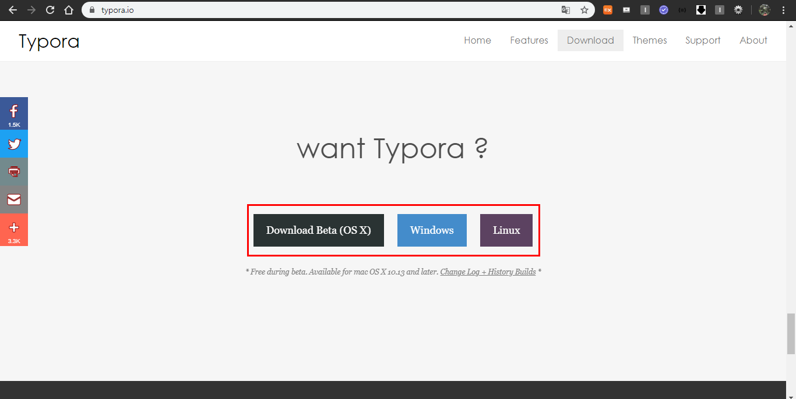
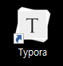
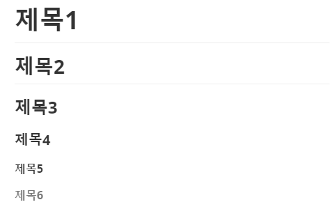
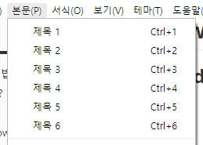
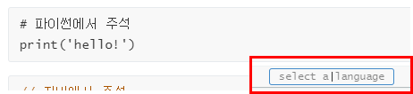
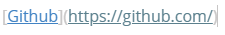
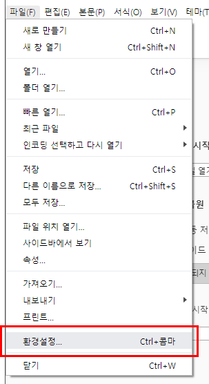
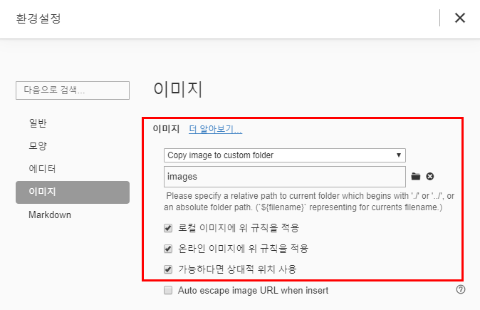
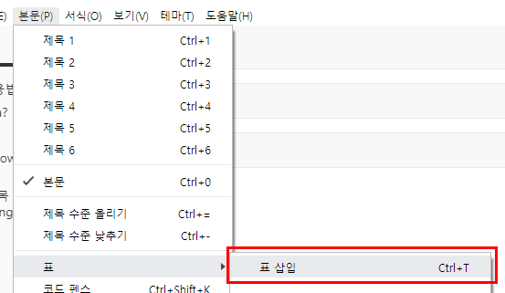
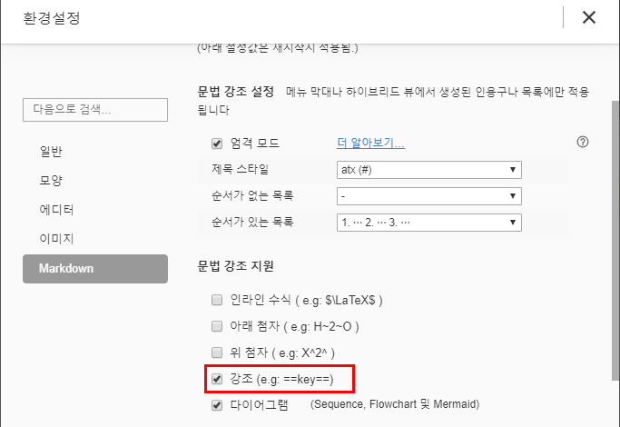

# Typora 사용법

## 0. Typora?

마크다운 텍스트 에디터, github에 들어가면 readme.md를 보게되는데 확장자 md가 `markdown`이라는 뜻이다.

## 1. 설치

[https://www.typora.io/](https://www.typora.io/)

자신의 PC에 맞는 걸로 다운받는다.





Typora가 정상적으로 설치되었다.


## 2. markdown 기초문법

### 2.1 제목 (heading)

`#(띄어쓰기)(제목)`을 이용해서 작성

`h1` ~ `h6` 까지 존재

```
# 제목1
## 제목2
### 제목3
#### 제목4
##### 제목5
###### 제목6
```



**단축키**로 입력하는 방법




### 2.2 목록 (List)

목록은 `*` 또는`-` 또는`+` + `스페이스누름`을 통해 순서가 없는 목록을 작성할 수 있고, `1.` + `스페이스누름`을 통해 순서가 있는 목록을 작성할 수 있다.

- 순서가 없는 목록

- 목록 내용

  - tab을 누르면 다음 레벨로 작성
  - 엔터누르기

  엔터누르기

- 엔터누르기

목록 밖

1. 순서가 있는 목록
2. 두번째 순서 목록

### 2.4 인용문

`>`를 사용해서 인용문을 작성할 수 있다.

> 이렇게 나타난다아아아ㅏ

### 2.5 코드블럭(펜스)

`(물결표시가 있는 키)

~~~  또는 ```을 입력하고 엔터를 치면 코드 블록 기능을 사용할 수 있다.



java, python 등의 언어를 select a language에 입력하게 되면 그 언어에 맞게 코드 블록의 내용이 하이라이팅 되서 나온다.

단순히 강조하고 싶을때는 `강조할 단어`를 쓰면 된다.

```python
# 파이썬에서 주석
print('hello!')
```

```java
// 자바에서 주석
public static void main(String[] args) { System.out.println("hello"); }
```

### 2.6 링크

`[이름](url)`를 사용한다.



[Github](https://github.com/)

[마크다운_가이드](https://guides.github.com/features/mastering-markdown/)

### 2.7 이미지

typora에서 이미지를 불러왔을 때, github에서도 이미지가 깨지지 않게 하기 위해서는 아래와 같은 설정을 한다.





### 2.8 표



| (1열)이름 | (2열)나이 |
| --------- | --------- |
| 김영선    | 24        |

### 2.9 수평선

`---`,`***`,`+++`을 입력하면 수평선이 입력된다.

---


### 2.10 텍스트 사용법

#### 굵은 글씨체

```
**굵은 글씨체**
__굵은 글씨체__
```

`ctrl + b` 

**굵은글씨체** 

#### 기울임체

```
*굵은 글씨체*
_굵은 글씨체_
```

_기울임체_

#### 굵은 글씨체 + 기울임체

```
***굵은 글씨체 + 기울임체***
___굵은 글씨체 + 기울임체___
```

***굵은 글씨체 + 기울임체***

#### 취소줄

```
~~취소줄~~
```

~~취소줄~~

#### 형광펜

환경설정에서 체크해줘야함



`==내용==` : ==내용== 왜안되니ㅣㅣㅣ